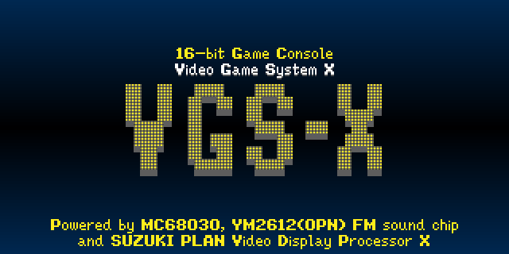
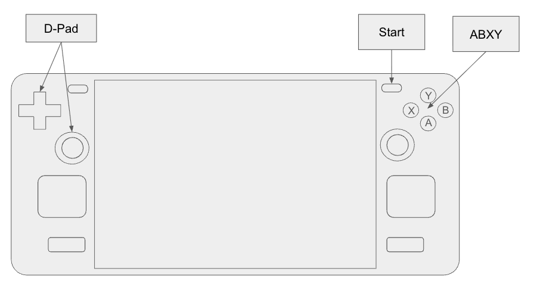

# VGS-X



## WIP

本プロジェクトは現在も _Work In Progress_（開発進行中）の段階にあります。

この README.md に記載されている機能はすべて実装済みですが、現行仕様は予告なく頻繁に変更される可能性がある点にご注意ください。

プロジェクトが安定段階に到達した際には、バージョン 1.0.0 をリリースする予定です。

Status

1. [x] MC680x0 ELF32 モジュールの実行
2. [x] VDP の実装
3. [x] 背景音楽（BGM）機能の実装
4. [x] 効果音（SFX）機能の実装
5. [x] ゲームパッド機能の実装
6. [x] beta 0.1.0 のリリース
7. [ ] Battle Hanafuda の製品版をリリース

バージョン 0.1.0 以降の変更履歴は [CHANGES.md](./CHANGES.md) を参照してください。

## About VGS-X

VGS-X は MC68030 プロセッサ、YM2612（OPN）FM サウンドチップ、MC68k アーキテクチャ向けに最適化した独自 VDP を搭載する 16 ビットゲーム機です。

Basic Features:

- CPU: MC68030 _(クロック制限なし)_
- [VGS Standard Library](#vgs-standard-library) との完全互換
- VDP: VGS-X Video
- [BGM](#0xe010xxo---background-music-bgm): .vgm 形式（YM2612）
- [SFX](#0xe011xxo---sound-effect-sfx): .wav 形式（44,100Hz, 16bit, 2ch）
- 高速 [DMA (Direct Memory Access)](#0xe00008-0xe00014io---direct-memory-access)
- 高速 [i-math（整数演算）](#0xe00100-0xe00118io---angle) API
- [セーブデータ](#0xe030xxio---savedata) 機能

VDP Features:

- 画面解像度: 320x200 ピクセル (内部的には 640x400)
- 色表現: 24bit カラー（RGB888）
- BG: 4 枚の [ネームテーブル](#name-table) と 2 種類のモード（[キャラクタパターン／ビットマップ](#0xd20028-0xd20034-bitmap-mode)）
- BG ネームテーブルサイズ: 256x256（2048x2048 ピクセル）
- BG 向け [ハードウェアスクロール](#0xd20008-0xd20024-hardware-scroll) 機能
- [キャラクタパターン](#character-pattern) 数: 65,536
- [OAM](#oam-object-attribute-memory)（スプライト）数: 1,024
- [スプライトサイズ](#size-of-sprite): 8x8～256x256 ピクセル
- 各スプライト単位で [回転](#rotate-of-sprite)・[拡大縮小](#scale-of-sprite)・[アルファブレンド](#alpha-blend-of-sprite)・[マスク](#mask-of-sprite) をサポート
- [ビットマップモード](#0xd20028-0xd20034-bitmap-mode) 向け [ビットマップ描画](#0xd2004c-0xd20068-bitmap-graphic-draw) 機能を搭載
- [ビットマップモード](#0xd20028-0xd20034-bitmap-mode) 向け [プロポーショナルフォント](#0xd2007c-0xd2008c-Proportional-font) 機能を搭載
- JIS-X-0201 / JIS-X-0208 の日本語表示に対応（k8x12 フォント利用）

ゲーム開発には MC68k 用 GCC（_GNU Compiler Collection_）を使用できます。

開発環境として公式にサポートする OS は **Ubuntu Linux** と **macOS** です。_(Windows を開発マシンとして使う場合は WSL2 の利用を推奨します。)_

ランタイム環境は Steam クライアントが対応する PC 用 OS（Windows / macOS / Linux）をすべてサポートします。

将来的には Nintendo Switch 1/2 と PlayStation 4/5 でも動作するランタイムを提供する予定です。NDA の関係で詳細は公開できませんが、[core](./src) モジュールは各ゲーム機の SDK 上でビルド・実行できることを確認済みです。

VGS-X は、一定性能の PC であればどこでも同一のゲーム体験を届けられる開発・配布環境を目指しています。

## Setup Build Environment

VGS-X は MC68030 ELF 形式のモジュールを実行するため、ゲーム開発には `m68k-elf-gcc` のインストールが必須です。

macOS では Homebrew から簡単に導入できますが、Ubuntu Linux には apt パッケージが存在しないため自前でビルドする必要があります。

### Setup Build Environment: macOS

Xcode と Homebrew を導入済みの環境で、`m68k-elf-gcc` と `SDL2` をインストールしてください。

```bash
brew install m68k-elf-gcc
brew install sdl2
```

### Setup Build Environment: Ubuntu Linux

以下は VGS-X 向けゲーム開発に必要なインストール手順です。

```bash
# 依存パッケージのインストール
sudo apt update
sudo apt install build-essential bison flex libgmp-dev libmpc-dev libmpfr-dev texinfo libncurses5-dev

# SDL2 と ALSA のインストール
sudo apt install libsdl2-dev libasound2 libasound2-dev

# m68k-elf ビルド用作業ディレクトリ
mkdir ~/m68k-work

# MC68k 用 binutils のビルドとインストール
cd ~/m68k-work
wget https://ftp.gnu.org/gnu/binutils/binutils-2.40.tar.gz
tar xvf binutils-2.40.tar.gz
cd binutils-2.40
mkdir ../binutils-build
cd ../binutils-build
../binutils-2.40/configure --target=m68k-elf --prefix=/usr/local/m68k-elf --disable-nls --disable-werror
make -j$(nproc)
sudo make install
export PATH=$PATH:/usr/local/m68k-elf/bin

# MC68k 用 GCC のビルドとインストール
cd ~/m68k-work
wget https://ftp.gnu.org/gnu/gcc/gcc-12.2.0/gcc-12.2.0.tar.gz
tar xvf gcc-12.2.0.tar.gz
cd gcc-12.2.0
./contrib/download_prerequisites
mkdir ../gcc-build
cd ../gcc-build
../gcc-12.2.0/configure --target=m68k-elf --prefix=/usr/local/m68k-elf --enable-languages=c --disable-nls --disable-libssp --without-headers
make all-gcc -j$(nproc)
make all-target-libgcc -j$(nproc)
sudo make install-gcc install-target-libgcc
```

ターミナル起動時にパスが通るよう、以下を ~/.zprofile に追記してください。

```.zprofile
export PATH=$PATH:/usr/local/m68k-elf/bin
```

> 参考資料  
> [https://computeralgebra.hatenablog.com/entry/2025/02/26/233231](https://computeralgebra.hatenablog.com/entry/2025/02/26/233231)  
> 執筆者の方に感謝いたします。

## Build and Execute an Example

`m68k-elf-gcc` のインストールが完了したら、VGS-X 向けゲーム開発を始められます。

以下は `git clone` で本リポジトリを取得し、「HELLO, WORLD!」を描画するサンプルを実行する手順です。

```bash
# ホームディレクトリへ移動
cd ~

# VGS-X リポジトリをクローン
git clone https://github.com/suzukiplan/vgsx

# サンプルディレクトリに移動
cd vgsx/example/01_hello

# ビルドと実行
make
```


## How to Create a New Project

[makeprj](#makeprj) コマンドを利用すると、新しいゲーム開発プロジェクトを作成できます。

```bash
# "My Game" という新規プロジェクトを作成
~/vgsx/tools/makeprj/makeprj ~/projects/MyGame
```

# Architecture Reference Manual

以下では、VGS-X でプログラミングを行う際に役立つ技術情報をまとめています。

## Screen Specification

- 画面解像度は固定で **320x200** ピクセルです。
- BG は 4 レイヤー、スプライトは 1 レイヤーです。
- 各 BG は [Character Pattern Mode](#character-pattern) と [Bitmap Mode](#0xd20028-0xd20034-bitmap-mode) の 2 モードを切り替えられます。
- スプライトは最大 1024 枚表示できます。

> _VGS-X の画面解像度 (320x200) は、SteamDeck (1280x800) で全画面表示できるよう設計されています。_

## 4k Display

VGS-X の解像度（座標系）は 320x200 ピクセルですが、内部的な画面バッファは 640x400 ピクセルです。

そして、スプライトやBGは常に 4倍サイズ（縦と横がそれぞれ2倍）で描画されています。

これにより、スプライトの拡大率が 50% 以上ならドット欠けが無く縮小表示することが可能です。

また、回転時のドット欠けも少なくなります。

## Memory Map

VGS-X では MC68030 の 24bit（16MB）アドレス空間のうち、先頭 12MB（0x000000 ～ 0xBFFFFF）がプログラム領域として割り当てられています。

末尾 1MB（0xF00000 ～ 0xFFFFFF）は WRAM（_Work RAM_）です。

プログラム領域と WRAM の間（0xC00000 ～ 0xEFFFFF = 3MB）が VDP および [I/O](#io-map) のメモリマップです。

| Address             | Size    | Description  |
|:-------------------:|--------:|:-------------|
| 0x000000 ~ 0xBFFFFF | 12288KB | [Program (ELF module)](#program) |
| 0xC00000 ~ 0xCFFFFF |  1024KB | [Name Table](#name-table) |
| 0xD00000 ~ 0xD0FFFF |    64KB | [OAM](#oam-object-attribute-memory) |
| 0xD10000 ~ 0xD1FFFF |    64KB | [Palette](#palette) |
| 0xD20000 ~ 0xD2FFFF |    64KB | [VDP Register](#vdp-register) |
| 0xD30000 ~ 0xDFFFFF |   832KB | Reserved     |
| 0xE00000 ~ 0xEFFFFF |  1024KB | [I/O](#io-map) |
| 0xF00000 ~ 0xFFFFFF |  1024KB | WRAM         |

0xC00000 ～ 0xEFFFFF の mmap 領域へのアクセスは、常に 32 ビット境界に整列させる必要があります。

> このアドレス空間では下位 2 ビットが常にマスクされるため、0xC00000～0xC00003 へのアクセスはすべて 0xC00000 へのアクセスとして扱われます。

[Character patterns](#character-pattern) やサウンドデータは参照専用の ROM に格納され、プログラムから直接参照することはできません。VGS-Zero と同様に、パターン番号で指定します。

## Program

プログラム領域（0x000000 ～ 0xBFFFFF）には [ELF32（Executable and Linkable Format 32bit）](https://refspecs.linuxfoundation.org/elf/gabi4+/ch4.intro.html) のバイナリモジュールを配置します。

VGS-X の電源投入時には、ROM カートリッジから読み込んだプログラムの ELF ヘッダで指定されたエントリポイントから実行が開始されます。

MC68k アセンブリのみでプログラムを記述する場合でも、必ず有効なエントリポイントと実行テキストを含む ELF32 ヘッダとプログラムヘッダを設定する必要があります。

> ただし VGS-X では高性能なコードをアセンブリだけで記述するメリットがほぼ無いため、全面的なアセンブリ実装は推奨しません。

VGS-X で動作するプログラムを生成する際に m68k-elf-gcc へ渡すべき主なオプションは以下の通りです。

```
m68k-elf-gcc
    -mc68030
    -O2
    -I${VGSX_ROOT}/lib
    -o program
    program.c
    -L${VGSX_ROOT}/lib
    -T${VGSX_ROOT}/lib/linker.ld
    -Wl,-ecrt0
```

VGS-X は C 標準ライブラリを提供しませんが、代わりに [VGS Standard Library](#vgs-standard-library) を提供しています。

> 例外として、GCC が提供する `stdarg.h` は利用できます。

## Character Pattern

VGS-X では最大 65,536 個のキャラクタパターンを利用できます。

1 つのキャラクタパターンは 8x8 ピクセルで構成されています。

データは次のビットレイアウトで 32 バイト分並びます。

| px0 | px1 | px2 | px3 | px4 | px5 | px6 | px7 | Line number |
| :-: | :-: | :-: | :-: | :-: | :-: | :-: | :-: | :---------- |
| H00 | L00 | H01 | L01 | H02 | L02 | H03 | L03 | Line 0      |
| H04 | L04 | H05 | L05 | H06 | L06 | H07 | L07 | Line 1      |
| H08 | L08 | H09 | L09 | H10 | L10 | H11 | L11 | Line 2      |
| H12 | L12 | H13 | L13 | H14 | L14 | H15 | L15 | Line 3      |
| H16 | L16 | H17 | L17 | H18 | L18 | H19 | L19 | Line 4      |
| H20 | L20 | H21 | L21 | H22 | L22 | H23 | L23 | Line 5      |
| H24 | L24 | H25 | L25 | H26 | L26 | H27 | L27 | Line 6      |
| H28 | L28 | H29 | L29 | H30 | L30 | H31 | L31 | Line 7      |

- `Hxx`: 上位 4 ビット（0～15 = カラー番号）
- `Lxx`: 下位 4 ビット（0～15 = カラー番号）

備考:

- ビットレイアウトは VGS-Zero と互換です。
- キャラクタパターンはプログラムから直接参照できません。ネームテーブルまたは OAM でパターン番号を指定して描画します。
- BG とスプライトでパターン番号を共有します。

> __WIP Note:__ 現状ではプログラム起動時に必要なキャラクタパターンをすべてロードする前提です。起動後に動的にパターンを書き換えることは制限する想定ですが、仕様変更の余地は検討中です。

## Palette

- 最大 16 個のパレットを使用できます。
- 各パレットは RGB888 形式で 16 色を保持します。
- カラー番号 0 は透明色です。
- パレット 0 のカラー番号 0 は背景（バックドロップ）色になります。

| Address             | Palette Number | Color Number |
|:-------------------:|:--------------:|:------------:|
| 0xD10000 ~ 0xD10003 |        0       |        0     |
| 0xD10004 ~ 0xD10007 |        0       |        1     |
| ... | ... | ... |
| 0xD103FC ~ 0xD103FF |       15       |       15     |

備考:

- ビットレイアウト: `******** rrrrrrrr gggggggg bbbbbbbb`
- 0xD10400 ～ 0xD1FFFF は 0xD10000 ～ 0xD103FF のミラーです（1024 バイト）。
- パレットテーブルへのアクセスは常に 4 バイト境界で行う必要があります。

## Name Table

- ネームテーブルは [属性](#attribute) を格納する 256x256 x 4 バイトの二次元配列です。
- 表示領域としては 40x25（320x200 ピクセル）を表示します。
- キャラクタパターンや属性データを設定することで、背景レイヤー上に描画できます。
- ネームテーブルは 4 層構造で、BG0 の上に BG1、さらに BG2、BG3 の順に重ねて表示されます。

| Address             | Size  | Name Table |
|:-------------------:|:----:|:----------:|
| 0xC00000 ~ 0xC3FFFF | 256KB | BG0 |
| 0xC40000 ~ 0xC7FFFF | 256KB | BG1 |
| 0xC80000 ~ 0xCBFFFF | 256KB | BG2 |
| 0xCC0000 ~ 0xCFFFFF | 256KB | BG3 |

[Bitmap Mode](#0xd20028-0xd20034-bitmap-mode) では、これらの領域は 320x200 ピクセルのフレームバッファとして扱われます。

ネームテーブルへのアクセスも常に 4 バイト境界で行ってください。

## Attribute

ネームテーブルおよび OAM の属性ビットは以下の通りです。

| Bit | Mnemonic | Description |
|:---:|:--------:|:------------|
| 0 | F/H | 水平方向の反転表示 |
| 1 | F/V | 垂直方向の反転表示 |
| 2~7 | reserved | 将来互換性のため 0 を設定してください |
| 12~15 | PAL | [Palette](#palette) 番号 (0~15) |
| 16~31 | PTN | [Character Pattern](#character-pattern) 番号 (0~65535) |

## OAM (Object Attribute Memory)

OAM は以下の構造体を持ちます。

```c
typedef struct {
    uint32_t visible;     // Visible (0 or not 0)
    int32_t y;            // Position (Y)
    int32_t x;            // Position (X)
    uint32_t attr;        // Attribute
    uint32_t size;        // Size (0: 8x8, 1: 16x16, 2: 24x24, 3: 32x32 ... 31: 256x256)
    int32_t rotate;       // Rotate (-360 ~ 360)
    uint32_t scale;       // Scale (0: disabled, or 1 ~ 400 percent)
    uint32_t alpha;       // Alpha (0: disabled, or 0x000001 ~ 0xFFFFFF)
    uint32_t mask;        // Mask (0: disabled, or RGB888)
    uint32_t sly;         // Scale Lock (Y)
    uint32_t slx;         // Scale Lock (X)
    uint32_t pri;         // High Priority Flag
    uint32_t ram_ptr;     // Bitmap Sprite Buffer (RGB888)
    uint32_t rom_ptr;     // Bitmap Sprite Buffer (RGB888)
    uint32_t reserved[2]; // Reserved
} ObjectAttributeMemory;
```

各属性の仕様は次の通りです。

| Name | Valid Range | Description |
|:-----|:-----------:|:------------|
| visible | 0 or 非 0 | 非 0 のときスプライトを描画 |
| y | -32768 ~ 32767 | スプライトの Y 座標 |
| x | -32768 ~ 32767 | スプライトの X 座標 |
| attr | 32bit | [Attribute](#attribute) |
| size | 0 ~ 31 | [Size](#size-of-sprite) |
| rotate | -360 ~ 360 | [Rotate](#rotate-of-sprite) |
| scale | 0 ~ 400 | [Scale](#scale-of-sprite) |
| alpha | 0 or 0xRRGGBB | [Alpha Blend](#alpha-blend-of-sprite) |
| mask | 0 or 0xRRGGBB | [Mask](#mask-of-sprite) |
| sly  | 0 or 1 | Lock [Scale](#scale-of-sprite) (Y) |
| slx  | 0 or 1 | Lock [Scale](#scale-of-sprite) (X) |
| pri  | 0 or 1 | [High Priority Flag]() |
| ram_ptr | 0 or RAM addr  | [Bitmap Sprite](#bitmap-sprite) Buffer (RGB888) |
| rom_ptr | 0 or ROM addr  | [Bitmap Sprite](#bitmap-sprite) Buffer (RGB888) |
| reserved | - | 0 以外を設定しないでください |

### (Size of Sprite)

スプライトは `(size + 1) * 8` ピクセルの正方形として描画されます。

例えば size に 3（32x32 ピクセル）を指定すると、`16 = (size + 1) ^ 2` 個のパターンを次のように配置して描画します。

```
Size 3 Pattern Number Layout
+--------+--------+--------+--------+
|        |        |        |        |
| ptn+0  | ptn+1  | ptn+2  | ptn+3  |
|        |        |        |        |
+--------+--------+--------+--------+
|        |        |        |        |
| ptn+4  | ptn+5  | ptn+6  | ptn+7  |
|        |        |        |        |
+--------+--------+--------+--------+
|        |        |        |        |
| ptn+8  | ptn+9  | ptn+10 | ptn+11 |
|        |        |        |        |
+--------+--------+--------+--------+
|        |        |        |        |
| ptn+12 | ptn+13 | ptn+14 | ptn+15 |
|        |        |        |        |
+--------+--------+--------+--------+
```

### (Rotate of Sprite)

`rotate` に -360～360 の角度を指定すると、スプライトを回転させて描画できます。

ただし回転を有効にすると描画コストが増える点に注意してください。

[Angle](#0xe00100-0xe00118io---angle) 機能と組み合わせると、回転を伴う表現を容易に実装できます。

### (Scale of Sprite)

- `scale` に 0〜400 の範囲で拡大率（パーセンテージ）を指定できます。
- `slx` または `sly` のいずれかを 0 以外の値に設定すると、X 軸または Y 軸のいずれかのスケーリングが防止されます。

### (Alpha Blend of Sprite)

`alpha` にアルファブレンド値を 0x000000〜0xFFFFFF の範囲で指定できます。

RGB 各成分に異なるアルファ値を設定できます:

- 0xFF0000 を指定すると赤成分のみを描画
- 0x00FF00 を指定すると緑成分のみを描画
- 0x0000FF を指定すると青成分のみを描画

### (Mask of Sprite)

マスク色に RGB888 の非 0 値を指定すると、スプライトを単色で塗りつぶします。

シューティングゲームの自機の影など、[Scale](#scale-of-sprite)、[Alpha Blend](#alpha-blend-of-sprite)、Mask を組み合わせた表現に利用できます。

### (High Priority Flag)

High priority flag `pri` をセットすることで描画優先度を `pri` がセットされていないスプライトよりも優先することができる。

### (Bitmap Sprite)

Bitmap Sprite Buffer (RGB888) `ram_ptr` に RAM アドレス（0以外）または `rom_ptr` に ROM アドレス（0以外）をセットすることで [キャラクタパターン](#character-pattern) を用いずに RAM に設定された RGB888 形式（1px = 4bytes）のスプライトを表示することができる。

なお、`ram_ptr` と `rom_ptr` の両方が非0の場合、`ram_ptr` の指定が優先される。

※RAM/ROM バッファサイズ = `(size + 1) * 8` の二乗

## VDP Register

| Address | Name | Mnemonic | Description |
|:-------:|:----:|:--------:|:------------|
|0xD20000 |  R0  | SKIP     | [Skip Screen Update](#0xd20000-skip-screen-update) |
|0xD20004 |  R1  | SPOS     | [Sprites Position](#0xd20004-sprite-position) |
|0xD20008 |  R2  | SX0      | [Scroll X of BG0](#0xd20008-0xd20024-hardware-scroll) |
|0xD2000C |  R3  | SX1      | [Scroll X of BG1](#0xd20008-0xd20024-hardware-scroll) |
|0xD20010 |  R4  | SX2      | [Scroll X of BG2](#0xd20008-0xd20024-hardware-scroll) |
|0xD20014 |  R5  | SX3      | [Scroll X of BG3](#0xd20008-0xd20024-hardware-scroll) |
|0xD20018 |  R6  | SY0      | [Scroll Y of BG0](#0xd20008-0xd20024-hardware-scroll) |
|0xD2001C |  R7  | SY1      | [Scroll Y of BG1](#0xd20008-0xd20024-hardware-scroll) |
|0xD20020 |  R8  | SY2      | [Scroll Y of BG2](#0xd20008-0xd20024-hardware-scroll) |
|0xD20024 |  R9  | SY3      | [Scroll Y of BG3](#0xd20008-0xd20024-hardware-scroll) |
|0xD20028 |  R10 | BMP0     | [Bitmap Mode of BG0](#0xd20028-0xd20034-bitmap-mode) |
|0xD2002C |  R11 | BMP1     | [Bitmap Mode of BG1](#0xd20028-0xd20034-bitmap-mode) |
|0xD20030 |  R12 | BMP2     | [Bitmap Mode of BG2](#0xd20028-0xd20034-bitmap-mode) |
|0xD20034 |  R13 | BMP3     | [Bitmap Mode of BG3](#0xd20028-0xd20034-bitmap-mode) |
|0xD20038 |  R14 | CLSA     | [Clear Screen of All BGs](#0xd20038-0xd20048-clear-screen) |
|0xD2003C |  R15 | CLS0     | [Clear Screen of BG0](#0xd20038-0xd20048-clear-screen) |
|0xD20040 |  R16 | CLS1     | [Clear Screen of BG1](#0xd20038-0xd20048-clear-screen) |
|0xD20044 |  R17 | CLS2     | [Clear Screen of BG2](#0xd20038-0xd20048-clear-screen) |
|0xD20048 |  R18 | CLS3     | [Clear Screen of BG3](#0xd20038-0xd20048-clear-screen) |
|0xD2004C |  R19 | G_BG     | [Bitmap Graphic Draw](#0xd2004c-0xd20068-bitmap-graphic-draw) |
|0xD20050 |  R20 | G_X1     | [Bitmap Graphic Draw](#0xd2004c-0xd20068-bitmap-graphic-draw) |
|0xD20054 |  R21 | G_Y1     | [Bitmap Graphic Draw](#0xd2004c-0xd20068-bitmap-graphic-draw) |
|0xD20058 |  R22 | G_X2     | [Bitmap Graphic Draw](#0xd2004c-0xd20068-bitmap-graphic-draw) |
|0xD2005C |  R23 | G_Y2     | [Bitmap Graphic Draw](#0xd2004c-0xd20068-bitmap-graphic-draw) |
|0xD20060 |  R24 | G_COL    | [Bitmap Graphic Draw](#0xd2004c-0xd20068-bitmap-graphic-draw) |
|0xD20064 |  R25 | G_OPT    | [Bitmap Graphic Draw](#0xd2004c-0xd20068-bitmap-graphic-draw) |
|0xD20068 |  R26 | G_EXE    | [Bitmap Graphic Draw](#0xd2004c-0xd20068-bitmap-graphic-draw) |
|0xD2006C |  R27 | SKIP0    | [Skip Rendering BG0](#0xd2006c-0xd20078-skip-rendering-a-specific-bg) |
|0xD20070 |  R28 | SKIP1    | [Skip Rendering BG1](#0xd2006c-0xd20078-skip-rendering-a-specific-bg) |
|0xD20074 |  R29 | SKIP2    | [Skip Rendering BG2](#0xd2006c-0xd20078-skip-rendering-a-specific-bg) |
|0xD20078 |  R30 | SKIP3    | [Skip Rendering BG3](#0xd2006c-0xd20078-skip-rendering-a-specific-bg) |
|0xD2007C |  R31 | PF_INIT  | [Proportional Font](#0xd2007c-0xd2008c-Proportional-font) の初期化 |
|0xD20080 |  R32 | PF_PTN   | [Proportional Font](#0xd2007c-0xd2008c-Proportional-font) パターン番号 |
|0xD20084 |  R33 | PF_DX    | [Proportional Font](#0xd2007c-0xd2008c-Proportional-font) diff-X |
|0xD20088 |  R34 | PF_DY    | [Proportional Font](#0xd2007c-0xd2008c-Proportional-font) diff-Y |
|0xD2008C |  R35 | PF_WIDTH | [Proportional Font](#0xd2007c-0xd2008c-Proportional-font) 幅 |
|0xD20090 |  R36 | CP_FR    | [Copy Character Pattern (From)](#0xd20090-0xd20094-copy-character-pattern) |
|0xD20094 |  R37 | CP_TO    | [Copy Character Pattern (To)](#0xd20090-0xd20094-copy-character-pattern) |

VDP レジスタへのアクセスも常に 4 バイト境界で行ってください。

### 0xD20000: Skip Screen Update

このレジスタに非 0 を設定すると、毎フレーム（60fps）の画面更新をスキップします。

### 0xD20004: Sprite Position

スプライトを表示する BG レイヤーを 0～3 の範囲で指定します。

- 0: BG0 の上、BG1～BG3 の下にスプライトを表示
- 1: BG1 の上、BG2～BG3 の下に表示
- 2: BG2 の上、BG3 の下に表示
- 3: BG3 の上に表示

### 0xD20008-0xD20024: Hardware Scroll

ハードウェアスクロールレジスタは Character Pattern Mode と Bitmap Mode で挙動が異なります。

#### (for Character Pattern Mode)

各 BG 面は 2048x2048 ピクセルの仮想表示領域を持ちます。

BG ごとに SX・SY 座標を 0～2047 の範囲で設定し、左上を表示原点として指定します。

#### (for Bitmap Mode)

- `SX` に正の値を書き込むと右方向に指定ピクセル分スクロールします。
- `SX` に負の値を書き込むと左方向にスクロールします。
- `SY` に正の値を書き込むと下方向にスクロールします。
- `SY` に負の値を書き込むと上方向にスクロールします。

### 0xD20028-0xD20034: Bitmap Mode

各 BG ごとに Character Pattern Mode と Bitmap Mode を切り替えられます。1 を書き込むとビットマップモード、0 でキャラクタパターンモードです。

### 0xD20038-0xD20048: Clear Screen

- R14 (CLSA) に値を書き込むと全 BG を同じ値でクリアします。
- R15～R18 (CLS0～CLS3) に値を書き込むと、対応する BG の表示領域を指定した値で埋めます。

### 0xD2004C-0xD20068: Bitmap Graphic Draw

ビットマップモード用の描画コマンドです。以下を設定して R26 (G_EXE) に命令番号を書き込むことで描画を実行します。

- R19 (G_BG): 描画対象の BG
- R20, R21 (G_X1, G_Y1): 描画開始座標
- R22, R23 (G_X2, G_Y2): 描画終了座標
- R24 (G_COL): 描画色
- R25 (G_OPT): オプション

### 0xD2006C-0xD20078: Skip Rendering a Specific BG

対応する BG の描画をスキップしたい場合、SKIP0～SKIP3 に非 0 を設定してください。

### 0xD2007C-0xD2008C: Proportional Font

プロポーショナルフォント描画のための座標初期化や差分移動量、表示幅を設定します。

### 0xD20090-0xD20094: Copy Character Pattern

`CP_FR` で指定したパターンを `CP_TO` で指定したパターンへコピーします。

## 0xE00000[out] - Console Output

`0xE00000` に出力すると、ホスト環境のコンソールに文字列を表示できます。

## 0xE00000[in] - V-SYNC

`0xE00000` から読み出すと V-SYNC を待ちます。1 フレーム（60fps）ごとに同期を取る際に利用してください。

## 0xE00004[out] - Exit

ユーザープログラムを終了し、終了コードを返します。

## 0xE00008-0xE00014[io] - Direct Memory Access

DMA を用いて高速にメモリ転送を行えます。

### DMA Copy

- `Source` で転送元アドレスを指定します。
- `Destination` で転送先アドレスを指定します。
- `Argument` で転送バイト数を指定します。
- `Command` に 0 を書き込むと実行します。

備考:

- `Source` と `Destination` はプログラム領域（0x000000～プログラムサイズ）または RAM（0xF00000～0xFFFFFF）である必要があります。
- 転送元・転送先が RAM の場合、範囲が重なっていても安全に転送されます（`memmove` 相当）。
- 無効なアドレス範囲を指定すると DMA は実行されません。

### DMA Set

`Source` の下位 8 ビットに指定した値で、`Destination` から `Argument` バイト分を埋めます。

備考:

- `Source` の上位 24 ビットは無視されます。
- `Destination` は RAM（0xF00000～0xFFFFFF）である必要があります。
- 無効なアドレス範囲を指定すると DMA は実行されません。

### DMA UTF8 to SJIS String

`Source` に設定した UTF-8 文字列（終端 0）を SJIS に変換しながら `Destination` にコピーします。

- `Source` はプログラム領域または RAM である必要があります。
- `Destination` は RAM である必要があります。

### DMA UTF8 to SJIS Character

UTF-8 の 1 文字を SJIS に変換します。`Source` に 1 文字分の UTF-8 データ、`Destination` に 2 バイト以上の RAM を指定し、結果を格納します。

## 0xE00100-0xE00118[io] - Angle

二点 (X1, Y1) と (X2, Y2) の角度（0～359 度）を高速に算出します。

```c
VGS_OUT_ANGLE_X1 = x1;
VGS_OUT_ANGLE_Y1 = y1;
VGS_OUT_ANGLE_X2 = x2;
VGS_OUT_ANGLE_Y2 = y2;
int32_t degree = VGS_IO_ANGLE_DEGREE;
```

`VGS_IO_ANGLE_DEGREE` を読み書きすると、その値を内部レジスタに保持します。続けて 0xE00114 を読むと整数サイン、0xE00118 を読むと整数コサインが取得できます。

```c
int32_t s = VGS_IN_ANGLE_SIN;
int32_t c = VGS_IN_ANGLE_COS;
```

通常の `sin` / `cos` 関数が -1.0～1.0 の倍精度を返すのに対し、VGS の整数版は -256～256 を返します。小数 8 ビットの固定小数点演算として扱うと便利です。

角度とサイン・コサインの関係は以下を参照してください。


[OAM](#oam-object-attribute-memory) の `[rotate](#rotate-of-sprite)` で指定する角度と [Angle](#0xe00100-0xe00118io---angle) の角度を一致させるため、スプライトのキャラクタパターンは右向きに描いておくと扱いやすくなります。


具体的な実装例は [./example/03_rotate/program.c](./example/03_rotate/program.c) を参照してください。


## 0xE010xx[o] - Background Music (BGM)

- 0xE01000 に VGM インデックスを設定すると BGM を再生します。
- 0xE01004 に 0 を書くと一時停止、1 を書くと再開、2 を書くとフェードアウトします。
- 0xE01008 で BGM マスターボリュームを設定・取得できます（0=0%、255=100%、既定値 255）。

VGS-X は YM2612(OPN2) と互換性のある VGM データを再生できます。データ作成には [Furnace Tracker](https://github.com/tildearrow/furnace) の利用を推奨します。

## 0xE011xx[o] - Sound Effect (SFX)

- 0xE01100 に .wav インデックスを書き込むと効果音を再生します。
- 0xE01104 にインデックスを書き込むと該当 SFX を停止します。
- 0xE01108 で SFX マスターボリュームを設定・取得できます（0=0%、255=100%、既定値 255）。

VGS-X の ROM カートリッジには 256 個までの .wav（44.1kHz / 16bit / ステレオ）を格納できます。

> VGS-Zero とほぼ同等の機能ですが、チャンネル数が異なります（VGS-Zero: 1ch、VGS-X: 2ch）。

以下のように `ffmpeg` で変換すると対応フォーマットの .wav を作成できます。

```bash
ffmpeg -i input.mp3 -acodec pcm_s16le -ar 44100 -ac 2 sfx.wav
```

## 0xE020xx[i] - Gamepad

VGS-X は下図のような D-Pad、ABXY、Start の入力を取得できます。



- ボタンが押されると対応する 0xE020xx の値が非 0 になります。
- カーソルキーと左スティックは常に連動します。
- `A` ボタンは決定、`B` ボタンはキャンセル、`X` ボタンは連打用途、`Y` ボタンは補助操作、`Start` ボタンはメニューやスタート用を想定しています。

代表的なゲームパッドとの対応は次の通りです。

| VGS-X and XBOX | PC Keybord | Switch | PlayStation |
|:-:|:-:|:-:|:-:|
| `A` | `Z` | `A` | `Cross` |
| `B` | `X` | `B` | `Circle` |
| `X` | `A` | `X` | `Square` |
| `Y` | `S` | `Y` | `Triangle` |
| `Start` | `Space` | `Plus` | `Options` |

> Switch のゲームパッド（Proコン）を用いる場合、A/B と X/Y の並び順が標準（XBOX）とは逆になる仕様です。

## 0xE021xx[io] - Gamepad Types

PC キーボード、Xbox、PlayStation、Nintendo Switch のいずれかの入力をサポートします。

0xE02100 を読み取ると現在接続されているゲームパッドの種別が取得できます。

```c
uint32_t gamepadType = VGS_KEY_TYPE;
switch (gamepadType) {
    case VGS_KEY_ID_KEYBOARD: vgs_putlog("Keyboard connected!"); break;
    case VGS_KEY_ID_XBOX:     vgs_putlog("XBOX gamepad connected!"); break;
    case VGS_KEY_ID_SWITCH:   vgs_putlog("Switch gamepad connected!"); break;
    case VGS_KEY_ID_PS:       vgs_putlog("PlayStation gamepad connected!"); break;
    default:                  vgs_putlog("Unknown gamepad connected!");
}
```

| Key Identifer | `#define` name |
|:-------------:|:---------------|
| 0 | VGS_KEY_ID_UNKNOWN |
| 1 | VGS_KEY_ID_KEYBOARD |
| 2 | VGS_KEY_ID_XBOX |
| 3 | VGS_KEY_ID_SWITCH |
| 4 | VGS_KEY_ID_PS |

> デバッグ目的に限り、0xE02100 にキー識別子を書き込んで接続種別を上書きできます。

0xE02104 ～ 0xE02114 を読むと、接続中のゲームパッドにおける ABXY／Start ボタンの識別子を取得できます。

| Button Identifer | `#define` name | Button Name String |
|:----------------:|:---------------|:-------------------|
| 0 | VGS_BUTTON_ID_UNKNOWN | `"UNKNOWN"` |
| 1 | VGS_BUTTON_ID_A | `"A"` |
| 2 | VGS_BUTTON_ID_B | `"B"` |
| 3 | VGS_BUTTON_ID_X | `"X"` |
| 4 | VGS_BUTTON_ID_Y | `"Y"` |
| 5 | VGS_BUTTON_ID_Z | `"Z"` |
| 6 | VGS_BUTTON_ID_S | `"S"` |
| 7 | VGS_BUTTON_ID_CROSS | `"CROSS"` |
| 8 | VGS_BUTTON_ID_CIRCLE | `"CIRCLE"` |
| 9 | VGS_BUTTON_ID_TRIANGLE | `"TRIANGLE"` |
| 10 | VGS_BUTTON_ID_SQUARE | `"SQUARE"` |
| 11 | VGS_BUTTON_ID_START | `"START"` |
| 12 | VGS_BUTTON_ID_SPACE | `"SPACE"` |
| 13 | VGS_BUTTON_ID_PLUS | `"+"` |
| 14 | VGS_BUTTON_ID_OPTIONS | `"OPTIONS"` |

0xE02108 にボタン ID を設定し、0xE0211C に 12 バイト以上の RAM アドレスを指定すると、ボタン名の文字列を格納できます。

```c
char buf[12];
VGS_OUT_KEY_BUTTON_ID = 14;
VGS_OUT_KEY_BUTTON_NAME = (uint32_t)buf;
// buf には "OPTIONS\\0" が格納されます
```

## 0xE030xx[io] - SaveData

セーブデータをストレージ（save.dat）に保存／読み込みできます。

```c
VGS_OUT_SAVE_ADDRESS = (uint32_t)&mydata; // RAM アドレス
VGS_IO_SAVE_EXECUTE = sizeof(mydata);     // RAM から save.dat へ書き込み
uint32_t size = VGS_IO_SAVE_EXECUTE;      // save.dat から RAM へ読み込み
```

備考:

- `0xE03000 (VGS_OUT_SAVE_ADDRESS)` は RAM（0xF00000～0xFFFFFF）である必要があります。
- セーブデータが破損している、または読み込みに失敗した場合、読み込み結果は 0 になります。

## 0xE031xx[io] - Large Sequencial File I/O

最大 1MB まで、バイト単位で順次アクセスするファイル I/O を提供します。リプレイデータの保存などに適しています。最大 256 個の順次ファイルを扱えます。

#### (Write Large Sequencial File)

```c
VGS_OUT_SEQ_OPEN_W = 0;
VGS_OUT_SEQ_WRITE  = 1;
VGS_OUT_SEQ_WRITE  = 2;
VGS_OUT_SEQ_WRITE  = 3;
VGS_OUT_SEQ_COMMIT = 0;
```

備考:

- 同時に書き込める順次ファイルは 1 つだけです。
- 読み込みと書き込みを同時に行うことはできますが、同じインデックスに対して同時に行うことはできません。
- 書き込みはメモリ上で処理され、ディスク I/O のオーバーヘッドは発生しません。
- 他のファイルを開く前に必ず `COMMIT` してください。未コミットのデータは失われます。

#### (Read Large Sequencial File)

```c
VGS_OUT_SEQ_OPEN_R = 0;
while (1) {
    uint32_t data = VGS_IN_SEQ_READ;
    if (0x100 < data) {
        break; // EOF
    }
    playback_replay(data);
}
```

備考:

- EOF に到達すると `VGS_IN_SEQ_READ` は `0xFFFFFFFF` を返します。
- 同時に複数の順次ファイルを読み込むことはできません。
- 読み込みと書き込みを同時に行うことはできますが、同じインデックスのファイルを同時に扱うことはできません。
- 読み込み処理もメモリ上で行われるため、ディスク I/O のオーバーヘッドは発生しません。

## 0xE040xx[i] - Random

乱数を取得します。0xE04000 は 8bit、0xE04004 は 16bit、0xE04008 は 32bit の乱数を返します。

## 0xE050xx[i] - Timer

V-SYNC に依存しない高精度タイマを提供します。0xE05000 で現在値、0xE05004 で差分を取得できます。

## 0xE060xx[o] - Window Title

0xE06000 にタイトル文字列（RAM アドレス）を書き込むと、ウィンドウタイトルを変更できます。

## 0xE070xx[o] - Window Size

0xE07000 / 0xE07004 に幅と高さ（ピクセル）を指定すると、ウィンドウサイズを変更します。

## 0xE080xx[io] - User-Defined I/O

ユーザープログラム側で自由に用途を定義できる I/O です。ランタイム実装側でコールバック処理を登録することで利用します。

## 0xE090xx[o] - Reset

0xE09000 に任意の値を書き込むとリセットがかかり、プログラムを再起動します。

## 0xE0A0xx[o] - Error Log

0xE0A000 にエラーコード、0xE0A004 にエラーメッセージ（RAM アドレス）を設定すると、ホスト側にエラーログを通知できます。

## I/O Map

VGS-X における I/O は 0xE00000～0xEFFFFF のメモリ領域に 32 ビット値でアクセスすることで実行します。

| Address  | In  | Out | Description |
|:--------:|:---:|:---:|:------------|
| 0xE00000 |  o  |  -  | [V-SYNC](#0xe00000in---v-sync) |
| 0xE00000 |  -  |  o  | [Console Output](#0xe00000out---console-output) |
| 0xE00004 |  o  |  o  | [Random](#0xe00004io---random) |
| 0xE00008 |  -  |  o  | [DMA: Destination](#0xe00008-0xe00014io---direct-memory-access) |
| 0xE0000C |  -  |  o  | [DMA: Source](#0xe00008-0xe00014io---direct-memory-access) |
| 0xE00010 |  -  |  o  | [DMA: Argument](#0xe00008-0xe00014io---direct-memory-access) |
| 0xE00014 |  o  |  o  | [DMA: Execute](#0xe00008-0xe00014io---direct-memory-access) |
| 0xE00100 |  -  |  o  | [Angle: X1](#0xe00100-0xe00118io---angle) |
| 0xE00104 |  -  |  o  | [Angle: Y1](#0xe00100-0xe00118io---angle) |
| 0xE00108 |  -  |  o  | [Angle: X2](#0xe00100-0xe00118io---angle) |
| 0xE0010C |  -  |  o  | [Angle: Y2](#0xe00100-0xe00118io---angle) |
| 0xE00110 |  o  |  o  | [Angle: Degree (0～359)](#0xe00100-0xe00118io---angle) |
| 0xE00114 |  o  |  -  | [Angle: int-sin (-256～256)](#0xe00100-0xe00118io---angle) |
| 0xE00118 |  o  |  -  | [Angle: int-cos (-256～256)](#0xe00100-0xe00118io---angle) |
| 0xE01000 |  -  |  o  | [Play BGM](#0xe010xxo---background-music-bgm) |
| 0xE01004 |  -  |  o  | [BGM Control](#0xe010xxo---background-music-bgm) |
| 0xE01008 |  o  |  o  | [BGM Master Volume](#0xe010xxo---background-music-bgm) |
| 0xE01100 |  -  |  o  | [Play SFX](#0xe011xxo---sound-effect-sfx) |
| 0xE01104 |  -  |  o  | [Stop SFX](#0xe011xxo---sound-effect-sfx) |
| 0xE01108 |  o  |  o  | [SFX Master Volume](#0xe011xxo---sound-effect-sfx) |
| 0xE02000 |  o  |  -  | [Gamepad: D-pad Up](#0xe020xxi---gamepad) |
| 0xE02004 |  o  |  -  | [Gamepad: D-pad Down](#0xe020xxi---gamepad) |
| 0xE02008 |  o  |  -  | [Gamepad: D-pad Left](#0xe020xxi---gamepad) |
| 0xE0200C |  o  |  -  | [Gamepad: D-pad Right](#0xe020xxi---gamepad) |
| 0xE02010 |  o  |  -  | [Gamepad: A button](#0xe020xxi---gamepad) |
| 0xE02014 |  o  |  -  | [Gamepad: B button](#0xe020xxi---gamepad) |
| 0xE02018 |  o  |  -  | [Gamepad: X button](#0xe020xxi---gamepad) |
| 0xE0201C |  o  |  -  | [Gamepad: Y button](#0xe020xxi---gamepad) |
| 0xE02020 |  o  |  -  | [Gamepad: Start button](#0xe020xxi---gamepad) |
| 0xE02100 |  o  |  o  | [Gamepad: Type](#0xe021xxio---gamepad-types) |
| 0xE02104 |  o  |  -  | [Gamepad: Button ID (A)](#0xe021xxio---gamepad-types) |
| 0xE02108 |  o  |  -  | [Gamepad: Button ID (B)](#0xe021xxio---gamepad-types) |
| 0xE0210C |  o  |  -  | [Gamepad: Button ID (X)](#0xe021xxio---gamepad-types) |
| 0xE02110 |  o  |  -  | [Gamepad: Button ID (Y)](#0xe021xxio---gamepad-types) |
| 0xE02114 |  o  |  -  | [Gamepad: Button ID (Start)](#0xe021xxio---gamepad-types) |
| 0xE02118 |  -  |  o  | [Gamepad: Button Name (ID)](#0xe021xxio---gamepad-types) |
| 0xE0211C |  -  |  o  | [Gamepad: Button Name (Address)](#0xe021xxio---gamepad-types) |
| 0xE03000 |  o  |  -  | [SaveData: Address](#0xe030xxio---savedata) |
| 0xE03004 |  o  |  o  | [SaveData: Execute](#0xe030xxio---savedata) |
| 0xE03008 |  -  |  o  | [SaveData: Size](#0xe030xxio---savedata) |
| 0xE03100 |  o  |  -  | [Sequential: Open Write](#0xe031xxio---large-sequencial-file-io) |
| 0xE03104 |  o  |  -  | [Sequential: Write Byte](#0xe031xxio---large-sequencial-file-io) |
| 0xE03108 |  o  |  -  | [Sequential: Commit](#0xe031xxio---large-sequencial-file-io) |
| 0xE03110 |  o  |  -  | [Sequential: Open Read](#0xe031xxio---large-sequencial-file-io) |
| 0xE03114 |  -  |  o  | [Sequential: Read Byte](#0xe031xxio---large-sequencial-file-io) |
| 0xE04000 |  o  |  -  | [Calendar: Year](#0xe040xxin---calendar)|
| 0xE04004 |  o  |  -  | [Calendar: Month](#0xe040xxin---calendar)|
| 0xE04008 |  o  |  -  | [Calendar: Day of Month](#0xe040xxin---calendar)|
| 0xE0400C |  o  |  -  | [Calendar: Hour](#0xe040xxin---calendar)|
| 0xE04010 |  o  |  -  | [Calendar: Minute](#0xe040xxin---calendar)|
| 0xE04014 |  o  |  -  | [Calendar: Second](#0xe040xxin---calendar)|
| 0xE7FFF4 |  o  |  -  | [Abort](#0xe7fff4out---abort) |
| 0xE7FFF8 |  -  |  o  | [Reset](#0xe7fff8out---reset) |
| 0xE7FFFC |  -  |  o  | [Exit](#0xe7fffcout---exit) |
| 0xE80000 ~ 0xE8FFFC |  o  |  o  | [User-Defined I/O](#0xe8xxxxio---user-defined-io) |

## 0xE00000[in] - V-SYNC

MC68030 プログラムが 0xE00000 を読み込むと、VGS-X はその時点の VRAM を参照して BG0～BG3 とスプライトを描画し、60fps で同期を取った後に戻ります。

```c
// VRAM の更新処理
drawProc();

// 垂直同期を待つ（内部的に 0xE00000 へ入力）
vgs_vsync();

// 同期完了後の処理
afterDrawProc();
```

`vgs_vsync` 関数は [vgs.h](./lib/vgs.h) に定義されています。

> __設計方針__: この仕様により VGS-X の MC68030 には動作クロックという概念がありません。実行速度はホスト PC の性能に依存し、必要スペックの周知は開発者に委ねられます。

## 0xE00000[out] - Console Output

0xE00000 に値を書き込むとコンソールに文字列を出力できます。デバッグログなどに利用してください。

```c
vgs_print("Hello, World!\n");
```

`vgs_print` は [log.h](./lib/log.h) に定義されています。

## 0xE00004[i/o] - Random

- 0xE00004 に書き込むと乱数シードを設定できます。
- 0xE00004 を読み出すと 0～65535 の乱数を取得できます。
- 65,536 回呼び出すと 0～65,535 の値を重複なく取得できることを保証します。

## 0xE00008-0xE00014[i/o] - Direct Memory Access

| `Destination` | `Source` | `Argument` | `Execute` | Description |
|:-:|:-:|:-:|:-:|:-|
| - | ☑︎ | `target` | `in` | [Search](#dma-search) |
| ☑︎ | ☑︎ | `size` | `out(0)` | [Copy](#dma-copy) |
| ☑︎ | ☑︎ | `size` | `out(1)` | [Set](#dma-set) |
| ☑︎ | ☑︎ | - | `out(2)` | [UTF8 to SJIS](#dma-utf8-to-sjis-string) |
| ☑︎ | ☑︎ | - | `out(3)` | [UTF8 to SJIS (char)](#dma-utf8-to-sjis-character) |

#### DMA Search

`Source` で指定したアドレス以降から、`Argument` 下位 8 ビットに一致するデータを検索します。

- `Source` はプログラム領域または RAM を指定してください。
- 有効範囲外を参照した場合は戻り値 0 となります。
- 見つかった場合は一致したインデックスが返ります。
- 結果が期待できない検索を長時間行うとオーバーヘッドが大きくなる点に注意してください。

#### DMA Copy

`Source` から `Destination` へ `Argument` バイト分のデータを転送します。

- `Source` はプログラム領域または RAM。
- `Destination` は RAM。
- 両方が RAM の場合、領域が重なっていても `memmove` 相当で安全に転送されます。
- 無効な範囲を指定すると DMA は実行されません。

#### DMA Set

`Source` 下位 8 ビットで `Destination` から `Argument` バイト分を埋めます。

- `Source` 上位 24 ビットは無視されます。
- `Destination` は RAM である必要があります。
- 無効な範囲を指定すると DMA は実行されません。

#### DMA UTF8 to SJIS String

UTF-8 文字列（終端 0）を SJIS に変換しながら `Destination` にコピーします。

- `Source` はプログラム領域または RAM。
- `Destination` は RAM。

#### DMA UTF8 to SJIS Character

UTF-8 の 1 文字を SJIS に変換し、`Destination` に書き込みます。

### 0xE040xx[in] - Calendar

現在の日付と時刻を協定世界時（UTC）で数値表現として取得します。

- 0xE04000: Year (例: 2025)
- 0xE04004: Month (1 to 12)
- 0xE04008: Day of Month (1 to 31)
- 0xE0400C: Hour (0 to 23)
- 0xE04010: Minute (0 to 59)
- 0xE04014: Second (0 to 59)

### 0xE7FFF4[out] - Abort

スタックバックトレースを表示してプログラムを異常終了させます。

なお、コンパイルオプションで最適化 (`-O`) を指定した場合は正常にバックトレースが拾えないことがあります。

**本機能を利用する場合は一時的に最適化を無効にしてください。**

最適化無効で Abort した時の出力例:

```
[error] Stack trace (FP=0xFFFF74):
[error] #0: 0x001A78 <main+0x1286>
[error] #1: 0x001BDC <crt0+0xA>
```

> VGS-X のプログラムは初期エントリ `crt0` から `main` がコールされていることが分かります。

### 0xE7FFF8[out] - Reset

VGS-X にリセット要求を送ります。

### 0xE7FFFC[out] - Exit

VGS-X に終了要求を送ります。デバッグ用 SDL2 エミュレータでは、ここに書き込んだ値がプロセスの終了コードになります。

### 0xE8XXXX[i/o] - User-Defined I/O

0xE80000～0xE8FFFC のアドレス範囲はユーザー定義 I/O として利用できます。具体的な利用方法は [Runtime Implementation Guide](#runtime-implementation-guide) の [User-Defined I/O](#6-user-defined-io) を参照してください。


# VGS Standard Library

VGS Standard Library（Video Game System Standard Library）は、VGS-X と将来の VGS シリーズ間でユーザープログラムのソース互換性を最大限維持できるよう設計（標準化）された C 言語ライブラリ仕様です。典型的な 2D ゲームを制作する際に必要となる機能を網羅的に提供することを方針としています。

この README.md に記載された VGS-X のハードウェア機能は、すべて本ライブラリを経由して C 言語で記述したゲームプログラムから利用できます。

## Static Libraries

| Library | Header File | Desctiption |
|:--------|:------------|:------------|
| [libc.a](#libca---basic-function) (`-lc`) | [vgs.h](./lib/vgs.h) | 基本機能を提供します |
| [liblog.a](#libloga---logging-function) (`-llog`) | [log.h](./lib/log.h) | ログ出力用の補助ライブラリ |

各関数の仕様はヘッダファイルに Doxygen 形式で記述されているため、Visual Studio Code などのエディタで適切な C/C++ プラグインを用いれば、関数名入力時に概要を参照できます。

## libc.a - Basic Function

`libc.a` は VGS シリーズ向けゲーム開発を補助する API をまとめた C ライブラリです。`-lc` が暗黙にリンクされるため、リンクオプションで明示的に指定する必要はありません。

基本機能は [Video Game Functions](#video-game-functions) と [Standard Functions](#standard-functions) に分類され、いずれも [vgs.h](./lib/vgs.h) をインクルードするだけで利用できます。

```c
#include <vgs.h>
```

### (Video Game Functions)

| Category | Function | Description |
|:---------|:---------|:------------|
| system | `vgs_abort` | スタックバックトレースを出力して [Abort](#0xe7fff4out---abort) |
| system | `vgs_vsync` | 60fps の [V-SYNC](#0xe00000in---v-sync) と同期する |
| system | `vgs_user_in` | [User-Defined I/O](#0xe8xxxxio---user-defined-io) を入力する |
| system | `vgs_user_out` | [User-Defined I/O](#0xe8xxxxio---user-defined-io) を出力する |
| cg | `vgs_ptn_copy` | [Copy Character Pattern](#0xd20090-0xd20094-copy-character-pattern) を実行する |
| cg | `vgs_pal_get` | [Palette](#palette) から色コードを取得する |
| cg | `vgs_pal_set` | [Palette](#palette) に色コードを設定する |
| cg:bg | `vgs_bg_width` | [Character Pattern Mode](#0xd20028-0xd20034-bitmap-mode) における [Name Table](#name-table) の幅を取得する |
| cg:bg | `vgs_bg_height` | [Character Pattern Mode](#0xd20028-0xd20034-bitmap-mode) における [Name Table](#name-table) の高さを取得する |
| cg:bg | `vgs_chr_width` | 表示領域としての [Name Table](#name-table) の幅を取得する |
| cg:bg | `vgs_chr_height` | 表示領域としての [Name Table](#name-table) の高さを取得する |
| cg:bg | `vgs_put_bg` | [Character Pattern Mode](#0xd20028-0xd20034-bitmap-mode) の [BG](#name-table) に文字を描画する |
| cg:bg | `vgs_print_bg` | [Character Pattern Mode](#0xd20028-0xd20034-bitmap-mode) の [BG](#name-table) に文字列を描画する |
| cg:bg | `vgs_cls_bg_all` | 全 BG を [クリア](#0xd20038-0xd20048-clear-screen) する |
| cg:bg | `vgs_cls_bg` | 指定した BG を [クリア](#0xd20038-0xd20048-clear-screen) する |
| cg:bmp | `vgs_draw_mode` | BG の描画モードを [Bitmap Mode](#0xd20028-0xd20034-bitmap-mode) とキャラクタパターンで切り替える |
| cg:bmp | `vgs_draw_window` | [Bitmap Mode](#0xd20028-0xd20034-bitmap-mode) で表示領域を限定する [window](#0xd2004c-0xd20068-bitmap-graphic-draw) を設定する |
| cg:bmp | `vgs_read_pixel` | [Bitmap Mode](#0xd20028-0xd20034-bitmap-mode) の BG から [pixel](#0xd2004c-0xd20068-bitmap-graphic-draw) を取得する |
| cg:bmp | `vgs_draw_pixel` | [Bitmap Mode](#0xd20028-0xd20034-bitmap-mode) の BG に [pixel](#0xd2004c-0xd20068-bitmap-graphic-draw) を描画する |
| cg:bmp | `vgs_draw_line` | [Bitmap Mode](#0xd20028-0xd20034-bitmap-mode) の BG に [line](#0xd2004c-0xd20068-bitmap-graphic-draw) を描画する |
| cg:bmp | `vgs_draw_lineH` | [Bitmap Mode](#0xd20028-0xd20034-bitmap-mode) の BG に水平 [line](#0xd2004c-0xd20068-bitmap-graphic-draw) を描く |
| cg:bmp | `vgs_draw_lineV` | [Bitmap Mode](#0xd20028-0xd20034-bitmap-mode) の BG に垂直 [line](#0xd2004c-0xd20068-bitmap-graphic-draw) を描く |
| cg:bmp | `vgs_draw_box` | [Bitmap Mode](#0xd20028-0xd20034-bitmap-mode) の BG に [rectangle](#0xd2004c-0xd20068-bitmap-graphic-draw) を描く |
| cg:bmp | `vgs_draw_boxf` | [Bitmap Mode](#0xd20028-0xd20034-bitmap-mode) の BG に塗りつぶし矩形を描く |
| cg:bmp | `vgs_draw_clear` | [Bitmap Mode](#0xd20028-0xd20034-bitmap-mode) の BG で指定矩形を 0 クリアする |
| cg:bmp | `vgs_draw_character` | [Bitmap Mode](#0xd20028-0xd20034-bitmap-mode) の BG に [character-pattern](#character-pattern) を描く |
| cg:bg+bmp | `vgs_skip_bg` | [特定の BG の描画をスキップ](#0xd2006c-0xd20078-skip-rendering-a-specific-bg) する |
| cg:bg+bmp | `vgs_scroll` | BG を [スクロール](#0xd20008-0xd20024-hardware-scroll) する |
| cg:bg+bmp | `vgs_scroll_x` | BG を X 方向に [スクロール](#0xd20008-0xd20024-hardware-scroll) する |
| cg:bg+bmp | `vgs_scroll_y` | BG を Y 方向に [スクロール](#0xd20008-0xd20024-hardware-scroll) する |
| cg:sp | `vgs_sprite_priority` | スプライトの表示優先度を設定する |
| cg:sp | `vgs_sprite` | [OAM](#oam-object-attribute-memory) をまとめて設定する |
| cg:sp | `vgs_sprite_hide_all` | すべてのスプライトを非表示にする |
| cg:sp | `vgs_oam` | [OAM](#oam-object-attribute-memory) レコードを取得する |
| cg:sp | `vgs_sprite_alpha8` | スプライトのアルファ値を8bitで設定する |
| bmpfont | `vgs_pfont_init` | [Proportional Font](#0xd2007c-0xd2008c-Proportional-font) を初期化する |
| bmpfont | `vgs_pfont_get` | [Proportional Font](#0xd2007c-0xd2008c-Proportional-font) 情報を取得する |
| bmpfont | `vgs_pfont_set` | [Proportional Font](#0xd2007c-0xd2008c-Proportional-font) 情報を設定する |
| bmpfont | `vgs_pfont_print` | [Proportional Font](#0xd2007c-0xd2008c-Proportional-font) で文字列を描画する |
| bmpfont | `vgs_pfont_strlen` | [Proportional Font](#0xd2007c-0xd2008c-Proportional-font) で描画した文字列の幅を取得する |
| bmpfont | `vgs_k8x12_print` | [k8x12 フォント](#0xd2004c-0xd20068-bitmap-graphic-draw) で文字列を描画する |
| bgm | `vgs_bgm_master_volume` | [BGM](#0xe010xxo---background-music-bgm) のマスターボリュームを設定する |
| bgm | `vgs_bgm_master_volume_get` | [BGM](#0xe010xxo---background-music-bgm) のマスターボリュームを取得する |
| bgm | `vgs_bgm_play` | [BGM](#0xe010xxo---background-music-bgm) を再生する |
| bgm | `vgs_bgm_pause` | [BGM](#0xe010xxo---background-music-bgm) を一時停止する |
| bgm | `vgs_bgm_resume` | [BGM](#0xe010xxo---background-music-bgm) を再開する |
| bgm | `vgs_bgm_fadeout` | [BGM](#0xe010xxo---background-music-bgm) をフェードアウトする |
| sfx | `vgs_sfx_master_volume` | [SFX](#0xe011xxo---sound-effect-sfx) のマスターボリュームを設定する |
| sfx | `vgs_sfx_master_volume_get` | [SFX](#0xe011xxo---sound-effect-sfx) のマスターボリュームを取得する |
| sfx | `vgs_sfx_play` | [SFX](#0xe011xxo---sound-effect-sfx) を再生する |
| sfx | `vgs_sfx_stop` | [SFX](#0xe011xxo---sound-effect-sfx) を停止する |
| sfx | `vgs_sfx_stop_all` | すべての [SFX](#0xe011xxo---sound-effect-sfx) を停止する |
| gamepad | `vgs_key_up` | 方向キー上が押されているか確認する |
| gamepad | `vgs_key_down` | 方向キー下が押されているか確認する |
| gamepad | `vgs_key_left` | 方向キー左が押されているか確認する |
| gamepad | `vgs_key_right` | 方向キー右が押されているか確認する |
| gamepad | `vgs_key_a` | A ボタンが押されているか確認する |
| gamepad | `vgs_key_b` | B ボタンが押されているか確認する |
| gamepad | `vgs_key_x` | X ボタンが押されているか確認する |
| gamepad | `vgs_key_y` | Y ボタンが押されているか確認する |
| gamepad | `vgs_key_code` | 方向キーと ABXY ボタンの状態を `uint8_t` コードで取得する |
| gamepad | `vgs_key_code_up` | キーコードで方向キー上を確認する |
| gamepad | `vgs_key_code_down` | キーコードで方向キー下を確認する |
| gamepad | `vgs_key_code_left` | キーコードで方向キー左を確認する |
| gamepad | `vgs_key_code_right` | キーコードで方向キー右を確認する |
| gamepad | `vgs_key_code_a` | キーコードで A ボタンを確認する |
| gamepad | `vgs_key_code_b` | キーコードで B ボタンを確認する |
| gamepad | `vgs_key_code_x` | キーコードで X ボタンを確認する |
| gamepad | `vgs_key_code_y` | キーコードで Y ボタンを確認する |
| gamepad | `vgs_key_type` | 接続されている [Gamepad Type](#0xe021xxio---gamepad-types) を取得する |
| gamepad | `vgs_button_id_a` | 接続中パッドの A ボタンの [Button ID](#0xe021xxio---gamepad-types) を取得する |
| gamepad | `vgs_button_id_b` | 接続中パッドの B ボタンの [Button ID](#0xe021xxio---gamepad-types) を取得する |
| gamepad | `vgs_button_id_x` | 接続中パッドの X ボタンの [Button ID](#0xe021xxio---gamepad-types) を取得する |
| gamepad | `vgs_button_id_y` | 接続中パッドの Y ボタンの [Button ID](#0xe021xxio---gamepad-types) を取得する |
| gamepad | `vgs_button_id_start` | 接続中パッドの Start ボタンの [Button ID](#0xe021xxio---gamepad-types) を取得する |
| gamepad | `vgs_button_name` | ボタン識別子に対応する名称文字列を取得する |
| save | `vgs_save` | [SaveData](#0xe030xxio---savedata) を保存する |
| save | `vgs_load` | [SaveData](#0xe030xxio---savedata) を読み込む |
| save | `vgs_save_check` | [SaveData](#0xe030xxio---savedata) のサイズを確認する |
| save | `vgs_seq_open_w` | [Large Sequencial File](#0xe031xxio---large-sequencial-file-io) を書き込み用に開く |
| save | `vgs_seq_write` | [Large Sequencial File](#0xe031xxio---large-sequencial-file-io) に 1 バイト書き込む |
| save | `vgs_seq_commit` | [Large Sequencial File](#0xe031xxio---large-sequencial-file-io) をコミットする |
| save | `vgs_seq_open_r` | [Large Sequencial File](#0xe031xxio---large-sequencial-file-io) を読み込み用に開く |
| save | `vgs_seq_read` | [Large Sequencial File](#0xe031xxio---large-sequencial-file-io) から 1 バイト読み込む |
| [calendar](#0xe040xxin---calendar) | `vgs_calendar_year` | 現在の年 (UTC) を取得 |
| [calendar](#0xe040xxin---calendar) | `vgs_calendar_month` | 現在の次 (UTC) を取得 |
| [calendar](#0xe040xxin---calendar) | `vgs_calendar_mday` | 現在の日 (UTC) を取得 |
| [calendar](#0xe040xxin---calendar) | `vgs_calendar_hour` | 現在の時間 (UTC) を取得 |
| [calendar](#0xe040xxin---calendar) | `vgs_calendar_minute` | 現在の分 (UTC) を取得 |
| [calendar](#0xe040xxin---calendar) | `vgs_calendar_second` | 現在の秒 (UTC) を取得 |

### (Standard Functions)

| Category | Function | Description |
|:---------|:---------|:------------|
| stdlib | `vgs_rand` | 16 ビットの [乱数](#0xe00004io---random) を取得する |
| stdlib | `vgs_rand32` | 32 ビットの [乱数](#0xe00004io---random) を取得する |
| stdlib | `vgs_srand` | [乱数](#0xe00004io---random) のシードを設定する |
| stdlib | `vgs_exit` | プログラムを [Exit](#0xe7fffcout---exit) させる |
| string | `vgs_d32str` | 32 ビット符号付き整数を文字列に変換する |
| string | `vgs_u32str` | 32 ビット符号なし整数を文字列に変換する |
| string | `vgs_memcpy` | [DMA Copy](#dma-copy) を利用した高速メモリコピー |
| string | `vgs_memset` | [DMA Set](#dma-set) を利用した高速メモリ初期化 |
| string | `vgs_strlen` | [DMA Search](#dma-search) を利用した高速文字列長取得 |
| string | `vgs_sjis_from_utf8` | [UTF-8 文字列を SJIS に変換](#dma-utf8-to-sjis-string) する |
| string | `vgs_strchr` | 文字列内の特定文字を検索する |
| string | `vgs_strrchr` | 文字列内の特定文字を後方から検索する |
| string | `vgs_strcmp` | 文字列を比較する |
| string | `vgs_stricmp` | 大文字/小文字を無視して文字列を比較する |
| string | `vgs_strncmp` | 指定長で文字列を比較する |
| string | `vgs_strstr` | 文字列内の部分文字列を検索する |
| string | `vgs_strcpy` | 文字列をコピーする |
| string | `vgs_strcat` | 文字列を連結する |
| ctype | `vgs_atoi` | 文字列を整数に変換する |
| ctype | `vgs_isdigit` | 文字が数字か判定する |
| ctype | `vgs_isupper` | 文字が大文字か判定する |
| ctype | `vgs_islower` | 文字が小文字か判定する |
| ctype | `vgs_isalpha` | 文字がアルファベットか判定する |
| ctype | `vgs_isalnum` | 文字が英数字か判定する |
| ctype | `vgs_toupper` | 小文字を大文字に変換する |
| ctype | `vgs_tolower` | 大文字を小文字に変換する |
| math | `vgs_degree` | 2 点間の [角度](#0xe00100-0xe00118io---angle) を度数で計算する |
| math | `vgs_sin` | [角度](#0xe00100-0xe00118io---angle) から整数サインを求める |
| math | `vgs_cos` | [角度](#0xe00100-0xe00118io---angle) から整数コサインを求める |
| math | `vgs_abs` | 整数の絶対値を求める |
| math | `vgs_sgn` | 整数の符号を判定する |
| math | `vgs_hitchk` | 矩形の当たり判定を行う |

## liblog.a - Logging Function

`liblog.a` はデバッグログ出力補助ライブラリです。リンク時に `-llog` を指定してください。

```c
#include <log.h>
```

| Function | Description |
|:---------|:------------|
| `vgs_print` | [Console Output](#0xe00000out---console-output) に改行なしで出力 |
| `vgs_println` | [Console Output](#0xe00000out---console-output) に改行付きで出力 |
| `vgs_putlog` | フォーマット付きテキストを出力 |

`vgs_putlog` は `%d`、`%u`、`%s` を使用できます。`%d` は `int32_t`、`%u` は `uint32_t` を渡してください。

```c
vgs_putlog("d32=%d, u32=%u, str=%s", (int32_t)123, (uint32_t)456, "text");
```

# Toolchain

| Name | Description |
|:-----|:------------|
| [vgsx](#vgs-x-emulator-for-debug) | デバッグ用 VGS-X エミュレータ |
| [bin2var](#bin2var) | バイナリを C 言語の配列に変換 |
| [bmp2chr](#bmp2chr) | [CHR](#character-pattern) データ生成 |
| [bmp2pal](#bmp2pal) | 初期 [palette](#palette) 生成 |
| [csv2var](#csv2var) | Tiled CSV をバイナリへ変換 |
| [makeprj](#makeprj) | 新規プロジェクト作成 |
| [makerom](#makerom) | プログラムとアセットから ROM を生成 |
| [vgmplay](#vgmplay) | コマンドラインで .vgm を再生 |

## VGS-X Emulator for Debug

パス: [./tools/sdl2/](./tools/sdl2/)

SDL2 を用いた VGS-X エミュレータです。主に開発時のデバッグ用途を想定しています。

```
usage: vgsx [-i]
            [-d]
            [-g /path/to/pattern.chr]
            [-c /path/to/palette.bin]
            [-b /path/to/bgm.vgm]
            [-s /path/to/sfx.wav]
            [-x expected_exit_code]
            { /path/to/program.elf | /path/to/program.rom }
```

- `-i` を指定するとブートロゴ表示後にアプリを起動します（`makerom` で生成した ROM が必要）。
- `-d` オプションを指定するとプログラム終了時に RAM とセーブデータのダンプを出力します。
- `-g`、`-b`、`-s` は複数指定可能です。
- .elf と .rom はヘッダ情報から自動判別します。
- `-x` は CI などのテスト用途向けで、ユーザープログラムの終了コードが期待値と一致すると 0、異なると -1 を返します。指定時は SDL の映像・音声出力を抑制します。

## bin2var

パス: [./tools/bin2var](./tools/bin2var/)

バイナリファイルを C 言語の `const uint8_t` 配列などに変換します。

```
bin2var /path/to/binary.rom [u8|u16|u16l|u16b]
```

- 変換結果は標準出力に出力されるのでリダイレクトして使用してください。
- `u8`: uint8_t として出力（既定）
- `u16`: uint16_t として出力
- `u16l`: little-endian として解釈（`u16` と同等）
- `u16b`: big-endian として解釈

## bmp2chr

パス: [./tools/bmp2chr](./tools/bmp2chr/)

256 色または 16 色の .bmp（Windows bitmap）ファイルまたは 256 色かつアルファチャンネルを含まない .png ファイルから VGS-X 用 [Character Pattern](#character-pattern) を生成します。

```
usage: bmp2chr input.png output.chr
```

- 画像の幅・高さは 8 の倍数である必要があります。
- 左上から 8x8 ピクセル単位で順に読み込みます。

## bmp2pal

パス: [./tools/bmp2pal](./tools/bmp2pal/)

256 色または 16 色の .bmp（Windows bitmap）ファイルまたは 256 色かつアルファチャンネルを含まない .png ファイルから VGS-X 用の初期 [Palette](#palette) を生成します。

```
usage: bmp2pal input.png palette.dat
```

## csv2var

パス: [./tools/csv2var](./tools/csv2var/)

Tiled Map Editor の CSV をバイナリに変換します。

```
usage: csv2var input.csv [u8|u16]
```

- レイヤーを持たない Tiled CSV のみに対応しています。
- 出力は標準出力に出力されるためリダイレクトして利用してください。
- `u8`: uint8_t で出力（既定）
- `u16`: uint16_t で出力

## makeprj

パス: [./tools/makeprj](./tools/makeprj/)

新しいゲームプロジェクトを作成します。

```
Usage: makeprj /path/to/project
```

- `makeprj` は [シンプルなシェルスクリプト](./tools/makeprj/makeprj) です。
- 指定するパスは存在しないディレクトリである必要があります。
- 作成されたプロジェクトディレクトリは Git で初期化され、作成時点の suzukiplan/vgsx リポジトリ最新版をサブモジュールとして含みます。VGS-X の仕様が更新された場合でも互換性を維持できます（必要に応じてサブモジュールを更新してください）。
- 後からルートディレクトリをリネーム／移動しても問題ありません。

プロジェクト内で VGS-X を最新版へ更新する手順:

```bash
cd /path/to/your_project
cd vgsx
git pull origin master
cd ..
git commit -m "update submodule" vgsx
```

> `make all` の実行時にサブモジュール初期化が行われるため、更新した場合は事前にコミットしておいてください。

## makerom

パス: [./tools/makerom](./tools/makerom/)

プログラムとアセットをまとめた ROM ファイルを生成します。

```
usage: makerom  -o /path/to/output.rom
                -e /path/to/program.elf
               [-c /path/to/palette.bin]
               [-g /path/to/pattern.chr ...]
               [-b /path/to/bgm.vgm ...]
               [-s /path/to/sfx.wav ...]
```

- `-g`、`-b`、`-s` は複数指定可能で、`-g file1 file2 file3` のように並べて指定もできます。
- 指定順にファイルを読み込み、最初の `-g` で指定したパターンがインデックス 0 に配置されます。

## vgmplay

コマンドラインで .vgm を再生します。

```
usage: vgmplay /path/to/bgm.vgm
```

> 既定ではビルドされないため、利用時は必要に応じてビルドしてください。

# Runtime Implementation Guide

## 1. Setup Your C++ Project

1. [core ソースコード](./src) を C++ プロジェクトに組み込みます（必要なファイル例は [./tools/sdl2/Makefile](./tools/sdl2/Makefile) を参照）。
2. `#include "vgsx.h"` を追加します。
3. `VGSX` クラスのシングルトン `vgsx` を通じてエミュレータを実行します。

## 2. Load a game ROM

[`makerom`](#makerom) で作成した ROM をロードする前に、`VGSX::enableBootBios` または `VGSX::disableBootBios` で BIOS 起動の有無を設定し、`VGSX::loadRom` で ROM を読み込みます。

```c++
vgsx.enableBootBios();
vgsx.loadRom(romData, romSize);
```

`romData` は VGS-X 実行中に解放しないでください。

> BIOS 起動は任意ですが、可能な限り有効化することを推奨します。

## 3. Main Loop Sequence

`VGSX::isExit` が `false` の間（ユーザープログラムが終了していない間）は、以下を繰り返してゲームを進行させます。

1. [Gamepad](#0xe020xxi---gamepad) の入力に応じて `vgsx.key.{up|down|left|right|a|b|x|y|start}` を 1/0 に設定
2. `VGSX::tick` で MC68030 を 1 フレーム（60fps）分実行
3. `VGSX::getDisplay` で表示用ピクセルデータを取得して画面描画
4. `VGSX::tickSound` でサウンド処理を 1 フレーム分実行

## 4. VGSX::tick

- `VGSX::tick` はユーザープログラムが [V-SYNC](#0xe00000in---v-sync) を要求するか終了するまで、4Hz 間隔で MC68030 を進めます。
- 呼び出し間隔は 1 秒あたり 60 回で維持してください。
- 画面処理と音声処理を別スレッドで並行処理する場合は、排他制御を適切に実装する必要があります。

## 5. VGSX::tickSound

- 多くの OS のサウンド API は固定サイズのバッファをコールバックで処理するため、`VGSX::tickSound` はそのコールバック内で呼び出すことを想定しています。
- PCM（44.1kHz / 16bit / 2ch）のバッファサイズに合わせて呼び出してください。

## 6. User-Defined I/O

ユーザー定義 I/O を利用する場合、`VGSX::tick` を呼び出す前に `VGSX::subscribeInput` / `VGSX::subscribeOutput` でコールバックを登録します。

```c++
// Subscribe Input
vgsx.subscribeInput([](uint32_t port) {
    return myInputFunction(port);
});

// Subscribe Output
vgsx.subscribeOutput([](uint32_t port, uint32_t value) {
    myOutputFunction(port, value);
});
```

これにより、MC68k 側だけでは扱えないネイティブ機能（例: Steam のリーダーボード参照や実績解除処理など）を連携させることが可能です。

# License

- [SDL2](https://www.libsdl.org/)
  - Copyright (C) 1997-2025 Sam Lantinga <slouken@libsdl.org>
  - License: [ZLIB License](./LICENSE-SDL2.txt)
- MC680x0 Emulator - [Musashi](https://github.com/kstenerud/Musashi)
  - Copyright © 1998-2001 Karl Stenerud
  - License: [MIT](./LICENSE-Musashi.txt)
- FM Sound Chip Emulator - [ymfm](https://github.com/aaronsgiles/ymfm)
  - Copyright (c) 2021, Aaron Giles
  - License: [3-clause BSD](./LICENSE-ymfm.txt)
- Japanese Font - [k8x12](https://littlelimit.net/k8x12.htm)
  - Created by Num Kadoma
  - License: [Free Software](./LICENSE-k8x12.txt)
- [VGS-X](https://github.com/suzukiplan/vgsx) and VGS Standard Library for MC68030
  - Copyright (c) 2025 Yoji Suzuki.
  - License: [MIT](./LICENSE-VGSX.txt)
