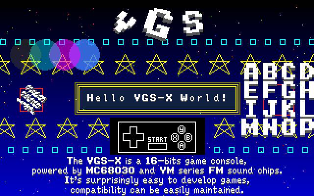
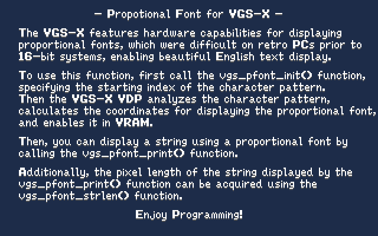
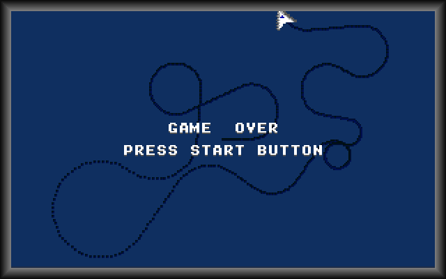
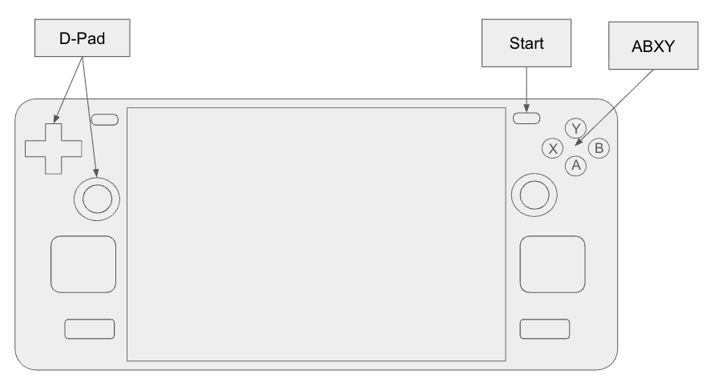

# VGS-X

## WIP

This project is still in the WIP; _Work In Progress_ phase.

All the features listed in this README.md have been implemented. However, please note that the current specifications are subject to frequent and unexpected changes.

Once this project reaches a stable phase, version 1.0.0 is scheduled for release.

Status

1. [x] Execute MC680x0 ELF32 module
2. [x] Implement VDP
3. [x] Implement Background Music function
4. [x] Implement Sound Effect function
5. [x] Implement Gamepad function
6. [x] Release beta 0.1.0
7. [ ] Make launch title for VGS-X

Changes after Version 0.1.0 can be found in [CHANGES.md](./CHANGES.md).

## About VGS-X

The VGS-X is a 16-bit game console featuring an MC68030 processor, the FM sound chips, and a proprietary VDP optimized for MC68k architecture.

Basic Features:

- CPU: MC68030 _(unlimited clocks)_
- Fully compatible with the [VGS Standard Library](#vgs-standard-library)
- VDP: VGS-X Video
- [BGM](#0xe010xxo---play-vgm): .vgm format (YM2149, YM2151, YM2203, YM2608, YM2610 and YM2612)
- [SFX](#0xe01100o---play-sfx): .wav format (44,100Hz, 16-bits, 2ch)
- High speed [DMA; Direct Memory Access](#0xe00008-0xe00014io---direct-memory-access)
- High speed [i-math (integer math)](#0xe00100-0xe00118io---angle) API
- [Save Data](#0xe030xxio---savedata)

VDP Features:

- Screen Resolution: 320x200 pixels
- Color: 24-bits color (RGB888)
- BG: Four [nametables](#name-table), and Two modes ([Character Pattern and Bitmap](#0xd20028-0xd20034-bitmap-mode))
- BG nametable size: 256x256 (2048x2048 pixels)
- Supported the BG [Hardware Scroll](#0xd20008-0xd20024-hardware-scroll) function
- [Character Pattern](#character-pattern) number: 65,536
- Number of [OAM](#oam-object-attribute-memory) (Sprites): 1,024
- [Size of Sprite](#size-of-sprite): from 8x8 pixels to 256x256 pixels
- Supports [Rotation](#rotate-of-sprite), [Scaling](#scale-of-sprite), [Alpha-blending](#alpha-blend-of-sprite) and [Mask](#mask-of-sprite) for each sprites
- Supports the [Bitmap Graphic Draw](#0xd2004c-0xd20068-bitmap-graphic-draw) functions for [Bitmap Mode](#0xd20028-0xd20034-bitmap-mode)
- Supports the [Proportional Font](#0xd2007c-0xd2008c-Proportional-font) functions for [Bitmap Mode](#0xd20028-0xd20034-bitmap-mode)
- Supports Japanese display for JIS-X-0201 and JIS-X-0208 using k8x12 for [Bitmap Mode](#0xd20028-0xd20034-bitmap-mode)

Games can be developed using the GCC; _GNU Compiler Collection_ for MC68k.

Supported development environment operating systems are **Ubuntu Linux** or **macOS**. _(If you want to use Windows as a development machine, please use WSL2.)_

The runtime environment supports the all of PC operating systems (Windows, macOS, and Linux) that supported by Steam Client.

In the future, we also plan to provide runtimes capable of running on Nintendo Switch 1/2 and PlayStation 4/5. Due to an NDA, we cannot disclose details, but we will be confirmed that the [core](./src) modules can be built and run using the SDKs for those game consoles.

VGS-X aims to provide game developers and publishers with an environment that enables them to deliver games that are fully compatible across any computer with certain performance specifications.

## Setup Build Environment

Since VGS-X can execute MC68030 ELF format modules, you must install `m68k-elf-gcc` to develop games for VGS-X.

On macOS, it can be easily installed via Homebrew. However, since no apt package is provided for Ubuntu Linux, you will need to build it yourself.

### Setup Build Environment: macOS

Please install `m68k-elf-gcc` and `SDL2` in an environment where Xcode and Homebrew are installed.

```bash
brew install m68k-elf-gcc
brew install sdl2
```

### Setup Build Environment: Ubuntu Linux

Below are the installation steps required for game development for the VGS-X.

```bash
# Install Dependencies
sudo apt update
sudo apt install build-essential bison flex libgmp-dev libmpc-dev libmpfr-dev texinfo libncurses5-dev

# Install SDL2 and ALSA
sudo apt install libsdl2-dev libasound2 libasound2-dev

# Make a work directory for build m68k-elf
mkdir ~/m68k-work

# Build and Install the binutils for MC68k
cd ~/m68k-work
wget https://ftp.gnu.org/gnu/binutils/binutils-2.40.tar.gz
tar xvf binutils-2.40.tar.gz
cd binutils-2.40
mkdir ../binutils-build
cd ../binutils-build
../binutils-2.40/configure --target=m68k-elf --prefix=/usr/local/m68k-elf --disable-nls --disable-werror
make -j$(nproc)
sudo make install
export PATH=$PATH:/usr/local/m68k-elf/bin

# Build and Install GCC for MC68k
cd ~/m68k-work
wget https://ftp.gnu.org/gnu/gcc/gcc-12.2.0/gcc-12.2.0.tar.gz
tar xvf gcc-12.2.0.tar.gz
cd gcc-12.2.0
./contrib/download_prerequisites
mkdir ../gcc-build
cd ../gcc-build
../gcc-12.2.0/configure --target=m68k-elf --prefix=/usr/local/m68k-elf --enable-languages=c --disable-nls --disable-libssp --without-headers
make all-gcc -j$(nproc)
make all-target-libgcc -j$(nproc)
sudo make install-gcc install-target-libgcc
```

Add the following line to ~/.zprofile so that the path is set when Terminal launches.

```.zprofile
export PATH=$PATH:/usr/local/m68k-elf/bin
```

> We referenced the following article.
>
> [https://computeralgebra.hatenablog.com/entry/2025/02/26/233231](https://computeralgebra.hatenablog.com/entry/2025/02/26/233231).
>
> We would like to thank the author for writing it!

## Build and Execute an Example

If you've finished installing `m68k-elf-gcc`, you're now ready to start developing games for the VGS-X.

The following steps show how to obtain this repository using `git clone` and then run the example that displays “HELLO, WORLD!”.

```bash
# Move to the home directory.
cd ~

# Clone the VGS-X repository
git clone https://github.com/suzukiplan/vgsx

# Move to the example directory
cd vgsx/example/01_hello

# Build and Execute
make
```



## How to Create a New Project

You can create a new project for developing your game by executing the [makeprj](#makeprj) command.

```bash
# Create a new project: "My Game"
~/vgsx/tools/makeprj/makeprj ~/projects/MyGame
```

# Architecture Reference Manual

The following sections provide technical information useful for programming with VGS-X.

## Screen Specification

- It has a fixed screen resolution of **320x200** pixels.
- It has 4 layers of BGs and 1 layer of sprites.
- Each BGs has two modes: [Character Pattern Mode](#character-pattern) and [Bitmap Mode](#0xd20028-0xd20034-bitmap-mode).
- Sprites can display up to 1024.

> _The screen resolution of VGS-X (320x200) is designed to enable full-screen display on the SteamDeck (1280x800)._

## Memory Map

In VGS-X, the first 12MB (0x000000 ~ 0xBFFFFF) of the MC68030's 24-bit (16MB) address space is allocated for programs.

The final 1MB (0xF00000 ~ 0xFFFFFF) constitutes the WRAM; _Work RAM area_.

The space between the program and WRAM (0xC00000 ~ 0xEFFFFF = 3MB) constitutes the memory map for the VDP and [I/O](#io-map).

| Address             | Size    | Description  |
|:-------------------:|--------:|:-------------|
| 0x000000 ~ 0xBFFFFF | 12288KB | [Program (ELF module)](#program) |
| 0xC00000 ~ 0xCFFFFF |  1024KB | [Name Table](#name-table) |
| 0xD00000 ~ 0xD0FFFF |    64KB | [OAM](#oam-object-attribute-memory) |
| 0xD10000 ~ 0xD1FFFF |    64KB | [Palette](#palette) |
| 0xD20000 ~ 0xD2FFFF |    64KB | [VDP Register](#vdp-register) |
| 0xD30000 ~ 0xDFFFFF |   832KB | Reserved     |
| 0xE00000 ~ 0xEFFFFF |  1024KB | [I/O](#io-map) |
| 0xF00000 ~ 0xFFFFFF |  1024KB | WRAM         |

When accessing the address range 0xC00000 to 0xEFFFFF used as mmap, access must always be 32-bit aligned.

> Since the least significant two bits are always masked when accessing this address space, accesses to 0xC00000, 0xC00001, 0xC00002, and 0xC00003 always behave as if accessing 0xC00000.

[Character patterns](#character-pattern) and Sound data are stored in Read Only Memory, which cannot be directly referenced from the program. Like VGS-Zero, it is specified by pattern number.

## Program

The program area (0x000000 ~ 0xBFFFFF) contains the [ELF32 _(Executable and Linkable Format 32bit)_](https://refspecs.linuxfoundation.org/elf/gabi4+/ch4.intro.html) binary module.

When tune on the VGS-X, it begins executing the program from the entry point specified in the ELF header of the program loaded from the ROM cartridge.

Note that even if you wish to write your program solely in MC68k assembly language, you must always specify the ELF32 header and Program header that contains valid entry point and executable text.

> However, since there is no advantage to writing high-performance programs in assembly language on the VGS-X, we generally do not recommend writing programs entirely in assembly language.

The following command line the compilation options that must be specified when outputting programs that can run on VGS-X using m68k-elf-gcc.

```
m68k-elf-gcc
    -mc68030                     ... Compile as MC68030 binary
    -O2                          ... Optimize the Runtime Speed
    -I${VGSX_ROOT}/lib           ... Specify the VGS-X API header path using the -I option
    -o program                   
    program.c                    
    -L${VGSX_ROOT}/lib           ... Specify the VGS-X API archive path using the -L option
    -T${VGSX_ROOT}/lib/linker.ld ... Specify the linker.ld file describing the VGS-X memory map using the -T option.
    -Wl,-ecrt0                   ... Specify crt0 as the entry point when using the VGS-X runtime
```

Note that VGS-X does not provide the C standard library, but it does provide the [VGS Standard Library](#vgs-standard-library).

> As an exception, you can use the `stdarg.h` provided by GCC.

## Character Pattern

VGS-X can use 65,536 character patterns.

One character pattern is 8x8 pixels.

The data consists of 32 bytes with the following bit layout:

| px0 | px1 | px2 | px3 | px4 | px5 | px6 | px7 | Line number |
| :-: | :-: | :-: | :-: | :-: | :-: | :-: | :-: | :---------- |
| H00 | L00 | H01 | L01 | H02 | L02 | H03 | L03 | Line 0      |
| H04 | L04 | H05 | L05 | H06 | L06 | H07 | L07 | Line 1      |
| H08 | L08 | H09 | L09 | H10 | L10 | H11 | L11 | Line 2      |
| H12 | L12 | H13 | L13 | H14 | L14 | H15 | L15 | Line 3      |
| H16 | L16 | H17 | L17 | H18 | L18 | H19 | L19 | Line 4      |
| H20 | L20 | H21 | L21 | H22 | L22 | H23 | L23 | Line 5      |
| H24 | L24 | H25 | L25 | H26 | L26 | H27 | L27 | Line 6      |
| H28 | L28 | H29 | L29 | H30 | L30 | H31 | L31 | Line 7      |

- `Hxx` : Upper 4 bits (0 ~ 15 = color number)
- `Lxx` : Lower 4 bits (0 ~ 15 = color number)

Remarks:

- This bit layout is compatible with VGS-Zero.
- Character patterns cannot be referenced directly from the program. You can draw the desired character by specifying the pattern number in the name table or OAM.
- Character pattern number is shared between BGs and Sprites.

> __WIP Note:__ Currently, the character pattern specification assumes that all necessary patterns are loaded at program startup. This means we intend to restrict dynamic pattern rewriting after startup. However, we also believe there is room to consider changing this specification.

## Palette

- VGS-X allows up to 16 palettes
- Each palette can contain 16 colors in RGB888 format
- Color number 0 is the transparent color
- Color number 0 in Palette number 0 becomes the backdrop (overall background) color.

| Address             | Palette Number | Color Number |
|:-------------------:|:--------------:|:------------:|
| 0xD10000 ~ 0xD10003 |        0       |        0     |
| 0xD10004 ~ 0xD10007 |        0       |        1     |
| 0xD10008 ~ 0xD1000B |        0       |        2     |
|          :          |        :       |        :     |
| 0xD10034 ~ 0xD10037 |        0       |       13     |
| 0xD10038 ~ 0xD1003B |        0       |       14     |
| 0xD1003C ~ 0xD1003F |        0       |       15     |
| 0xD10040 ~ 0xD10043 |        1       |        0     |
| 0xD10044 ~ 0xD10047 |        1       |        1     |
| 0xD10048 ~ 0xD1004B |        1       |        2     |
|          :          |        :       |        :     |
| 0xD103F4 ~ 0xD103F7 |       15       |       13     |
| 0xD103F8 ~ 0xD103FB |       15       |       14     |
| 0xD103FC ~ 0xD103FF |       15       |       15     |

Remarks:

- Bit Layout: `******** rrrrrrrr gggggggg bbbbbbbb`
- 0xD10400 ~ 0xD1FFFF is a mirror of 0xD10000 ~ 0xD103FF (1024 bytes).
- Please note that access to the palette table must always be 4-byte aligned.

## Name Table

- The Name Table is a 256x256 x 4bytes two-dimensional array of the [attributes](#attribute). 
- The visible displayed area is 40x25 in the Name Table (256x256).
- By setting character patterns and attribute data to it, graphics can be displayed on the background layer.
- The Name Table has a four-layer structure, with BG1 displayed on top of BG0, BG2 on top of BG1, BG3 on top of BG2, and BG4 on top of BG3.

| Address             | Size  | Name Table |
|:-------------------:|:-----:|:----------:|
| 0xC00000 ~ 0xC3FFFF | 256KB |     BG0    |
| 0xC40000 ~ 0xC7FFFF | 256KB |     BG1    |
| 0xC80000 ~ 0xCBFFFF | 256KB |     BG2    |
| 0xCC0000 ~ 0xCFFFFF | 256KB |     BG3    |

In [Bitmap Mode](#0xd20028-0xd20034-bitmap-mode), these areas corresponds to 320x200 pixels.

Please note that access to the name table must always be 4-byte aligned.

## Attribute

The Bit-Layout of the Name Table and OAM's attribute are as follows:

|  Bit  | Mnemonic | Description |
|:-----:|:--------:|:------------|
|   0   |   F/H    | Flip Horizontal |
|   1   |   F/V    | Flip Vertical |
|  2~7  | reserved | Specify 0 to maintain future compatibility. |
| 12~15 |   PAL    | [Palette](#palette) Number (0~15) |
| 16~31 |   PTN    | [Character Pattern](#character-pattern) Number (0~65535) |

## OAM (Object Attribute Memory)

OAM is a structure with the following attributes.

```c
typedef struct {
    uint32_t visible;      // Visible (0 or not 0)
    int32_t y;             // Position (Y)
    int32_t x;             // Position (X)
    uint32_t attr;         // Attribute
    uint32_t size;         // Size (0: 8x8, 1: 16x16, 2: 24x24, 3: 32x32 ... 31: 256x256)
    int32_t rotate;        // Rotate (-360 ~ 360)
    uint32_t scale;        // Scale (0: disabled, or 1 ~ 400 percent)
    uint32_t alpha;        // Alpha Blend (0: disabled, or 0x000001 ~ 0xFFFFFF)
    uint32_t mask;         // Mask (0: disabled, or RGB888)
    uint32_t reserved[7];  // Reserved
} OAM;
```

The specifications for each attribute are shown in the table below.

| Name    | Valid Range | Description |
|:--------|:-----------:|:------------|
| visible | 0 or 1      | Display sprite with a non-zero setting. |
| y       | -32768 ~ 32767 | Sprite display coordinates |
| x       | -32768 ~ 32767 | Sprite display coordinates |
| attr    | 32bit          | [Attribute](#attribute) |
| size    | 0 ~ 31         | [Size](#size-of-sprite) |
| rotate  | -360 ~ 360     | [Rotate](#rotate-of-sprite) |
| scale   | 0 ~ 400        | [Scale](#scale-of-sprite) |
| alpha   | 0 or 0xRRGGBB  | [Alpha Blend](#alpha-blend-of-sprite) |
| mask    | 0 or 0xRRGGBB  | [Mask](#mask-of-sprite) |
| reserved| -              | Do not set a value other than zero. |

### (Size of Sprite)

Sprites are displayed as squares measuring `(size + 1) * 8` pixels.

For example, when size is set to 3 (32x32 pixels), the sprite is displayed using `16 = (size + 1) ^ 2` patterns. The layout of the pattern numbers at that time is as follows:

```
Size 3 Pattern Number Layout
+--------+--------+--------+--------+
|        |        |        |        |
| ptn+0  | ptn+1  | ptn+2  | ptn+3  |
|        |        |        |        |
+--------+--------+--------+--------+
|        |        |        |        |
| ptn+4  | ptn+5  | ptn+6  | ptn+7  |
|        |        |        |        |
+--------+--------+--------+--------+
|        |        |        |        |
| ptn+8  | ptn+9  | ptn+10 | ptn+11 |
|        |        |        |        |
+--------+--------+--------+--------+
|        |        |        |        |
| ptn+12 | ptn+13 | ptn+14 | ptn+15 |
|        |        |        |        |
+--------+--------+--------+--------+
```

### (Rotate of Sprite)

By specifying an angle (-360 to 360) for `rotate`, you can draw a rotated sprite.

Note that setting `rotate` to a non-zero value increases the sprite's drawing overhead.

The Sprite rotation feature is useful when combined with the [Angle](#0xe00100-0xe00118io---angle) function.

### (Scale of Sprite)

You can specify the magnification rate as a percentage on the `scale`, either 0 (disabled) or within the range of 1 to 400.

### (Alpha Blend of Sprite)

You can perform alpha blending by setting the alpha component of the OAM to a non-zero value.

For VGS-X, you can set different alpha values for each RGB color component.

For example:

- Providing 0xFF0000 draws only the red pigment
- Providing 0x00FF00 draws only the green pigment
- Providing 0x0000FF draws only the blue pigment

### (Mask of Sprite)

Setting a non-zero value (in RGB888 format) to the mask fills the sprite with the specified solid color.

_For example, combining the [Scale](#scale-of-sprite), [Alpha Blend](#alpha-blend-of-sprite), and Mask functions can be used to render the shadows of shoot 'em up aircraft._

## VDP Register

| Address | Name | Mnemonic | Description |
|:-------:|:----:|:--------:|:------------|
|0xD20000 |  R0  | SKIP     | [Skip Screen Update](#0xd20000-skip-screen-update) |
|0xD20004 |  R1  | SPOS     | [Sprites Position](#0xd20004-sprite-position) |
|0xD20008 |  R2  | SX0      | [Scroll X of BG0](#0xd20008-0xd20024-hardware-scroll) |
|0xD2000C |  R3  | SX1      | [Scroll X of BG1](#0xd20008-0xd20024-hardware-scroll) |
|0xD20010 |  R4  | SX2      | [Scroll X of BG2](#0xd20008-0xd20024-hardware-scroll) |
|0xD20014 |  R5  | SX3      | [Scroll X of BG3](#0xd20008-0xd20024-hardware-scroll) |
|0xD20018 |  R6  | SY0      | [Scroll Y of BG0](#0xd20008-0xd20024-hardware-scroll) |
|0xD2001C |  R7  | SY1      | [Scroll Y of BG1](#0xd20008-0xd20024-hardware-scroll) |
|0xD20020 |  R8  | SY2      | [Scroll Y of BG2](#0xd20008-0xd20024-hardware-scroll) |
|0xD20024 |  R9  | SY3      | [Scroll Y of BG3](#0xd20008-0xd20024-hardware-scroll) |
|0xD20028 |  R10 | BMP0     | [Bitmap Mode of BG0](#0xd20028-0xd20034-bitmap-mode) |
|0xD2002C |  R11 | BMP1     | [Bitmap Mode of BG1](#0xd20028-0xd20034-bitmap-mode) |
|0xD20030 |  R12 | BMP2     | [Bitmap Mode of BG2](#0xd20028-0xd20034-bitmap-mode) |
|0xD20034 |  R13 | BMP3     | [Bitmap Mode of BG3](#0xd20028-0xd20034-bitmap-mode) |
|0xD20038 |  R14 | CLSA     | [Clear Screen of All BGs](#0xd20038-0xd20048-clear-screen) |
|0xD2003C |  R15 | CLS0     | [Clear Screen of BG0](#0xd20038-0xd20048-clear-screen) |
|0xD20040 |  R16 | CLS1     | [Clear Screen of BG1](#0xd20038-0xd20048-clear-screen) |
|0xD20044 |  R17 | CLS2     | [Clear Screen of BG2](#0xd20038-0xd20048-clear-screen) |
|0xD20048 |  R18 | CLS3     | [Clear Screen of BG3](#0xd20038-0xd20048-clear-screen) |
|0xD2004C |  R19 | G_BG     | [Bitmap Graphic Draw](#0xd2004c-0xd20068-bitmap-graphic-draw) |
|0xD20050 |  R20 | G_X1     | [Bitmap Graphic Draw](#0xd2004c-0xd20068-bitmap-graphic-draw) |
|0xD20054 |  R21 | G_Y1     | [Bitmap Graphic Draw](#0xd2004c-0xd20068-bitmap-graphic-draw) |
|0xD20058 |  R22 | G_X2     | [Bitmap Graphic Draw](#0xd2004c-0xd20068-bitmap-graphic-draw) |
|0xD2005C |  R23 | G_Y2     | [Bitmap Graphic Draw](#0xd2004c-0xd20068-bitmap-graphic-draw) |
|0xD20060 |  R24 | G_COL    | [Bitmap Graphic Draw](#0xd2004c-0xd20068-bitmap-graphic-draw) |
|0xD20064 |  R25 | G_OPT    | [Bitmap Graphic Draw](#0xd2004c-0xd20068-bitmap-graphic-draw) |
|0xD20068 |  R26 | G_EXE    | [Bitmap Graphic Draw](#0xd2004c-0xd20068-bitmap-graphic-draw) |
|0xD2006C | R27 | SKIP0 | [Skip Rendering BG0](#0xd2006c-0xd20078-skip-rendering-a-specific-bg) |
|0xD20070 | R28 | SKIP1 | [Skip Rendering BG1](#0xd2006c-0xd20078-skip-rendering-a-specific-bg) |
|0xD20074 | R29 | SKIP2 | [Skip Rendering BG2](#0xd2006c-0xd20078-skip-rendering-a-specific-bg) |
|0xD20078 | R30 | SKIP3 | [Skip Rendering BG3](#0xd2006c-0xd20078-skip-rendering-a-specific-bg) |
|0xD2007C | R31 | PF_INIT | Initialize the [Proportional Font](#0xd2007c-0xd2008c-Proportional-font) coodinates. |
|0xD20080 | R32 | PF_PTN | [Proportional Font](#0xd2007c-0xd2008c-Proportional-font) pattern number |
|0xD20084 | R33 | PF_DX | [Proportional Font](#0xd2007c-0xd2008c-Proportional-font) diff-X |
|0xD20088 | R34 | PF_DY | [Proportional Font](#0xd2007c-0xd2008c-Proportional-font) diff-Y |
|0xD2008C | R35 | PF_WIDTH | [Proportional Font](#0xd2007c-0xd2008c-Proportional-font) width |

Please note that access to the VDP register must always be 4-byte aligned.

### 0xD20000: Skip Screen Update

Setting a value other than zero to this register will skip the screen update every frame (60fps).

### 0xD20004: Sprite Position

Specify the BG layer on which to display the sprite, within the range of 0 to 3.

- 0: Sprites are displayed above BG0 and below BG1 through BG3.
- 1: Sprites are displayed above BG1 and below BG2 through BG3.
- 2: Sprites are displayed above BG2 and below BG3.
- 3: Sprites are displayed above BG3

### 0xD20008-0xD20024: Hardware Scroll

The hardware scroll register behaves differently in Character Pattern Mode and Bitmap Mode.

#### (for Character Pattern Mode)

The VGS-X has a virtual display of 2048x2048 pixels for each BG plane.

For each BG plane, the SX and SY coordinates can be specified within the range 0 to 2047 to define the display origin at the top-left corner.

#### (for Bitmap Mode)

- Writing a positive number to `SX` scrolls the screen **right** by the specified number of pixels.
- Writing a negative number to `SX` scrolls the screen **left** by the specified number of pixels.
- Writing a positive number to `SY` scrolls the screen **down** by the specified number of pixels.
- Writing a negative number to `SY` scrolls the screen **upward** by the specified number of pixels.
- The area after scrolling will be cleared to zero.

### 0xD20028-0xD20034: Bitmap Mode

The VGS-X's display mode defaults to character pattern mode, but can be switched to bitmap mode by setting the BMP register (0xD20028-0xD20034).

- 0: Character Pattern Mode (default)
- 1: Bitmap Mode

When set to Bitmap mode, the name table corresponds to the pixels on the screen (320x200).

Each pixel is set in RGB888 format.

When the pixel color is 0x00000000, it becomes transparent.

### 0xD20038-0xD20048: Clear Screen

You can delete all BGs or specific BGs in bulk.

> Note that when the value to be cleared in bulk is 0, the process is faster compared to non-zero values.

### 0xD2004C-0xD20068: Bitmap Graphic Draw

You can draw various types of shapes to the BG in [Bitmap Mode](#0xd20028-0xd20034-bitmap-mode).

Drawing processing is executed when the execution identifier is written to `G_EXE`.

| `G_BG` | `G_X1` | `G_Y1` | `G_X2` | `G_Y2` | `G_COL` | `G_OPT` | `G_EXE` | Shape |
|:-:|:-:|:-:|:-:|:-:|:-:|:-:|:-:|:-|
|☑︎|☑︎|☑︎|-|-|☑︎|-| `0` | Pixel <sup>*1</sup> |
|☑︎|☑︎|☑︎|☑︎|☑︎|☑︎|-| `1` | Line |
|☑︎|☑︎|☑︎|☑︎|☑︎|☑︎|-| `2` | Box |
|☑︎|☑︎|☑︎|☑︎|☑︎|☑︎|-| `3` | Box Fill |
|☑︎|☑︎|☑︎|-|-|☑︎|☑︎| `4` | CHR <sup>*2</sup> |
|☑︎|☑︎|☑︎|-|-|☑︎|☑︎| `5` | JIS-X-0201 |
|☑︎|☑︎|☑︎|-|-|☑︎|☑︎| `6` | JIS-X-0208 |

Remarks:

1. Reading `G_EXE` allows you to read the color of the pixel drawn at the (`G_X1`, `G_Y1`) position on the background plane specified by `G_BG`.
2. When drawing a character, specify the palette number (0 to 15) in `G_COL` and the pattern number (0 to 65535) in `G_OPT`. Additionally, setting the most significant bit of `G_COL (0x80000000)` draws the transparent color, while resetting it skips drawing the transparent color.

> Please note that character drawing performance is not as good as in [Character Pattern Mode](#0xd20028-0xd20034-bitmap-mode).

### 0xD2006C-0xD20078: Skip Rendering a Specific BG

Skip displaying a specified BG plane.

This function only skips displaying information on the screen. Information that has already been drawn remains stored in VRAM, so you can read the pixel color using `vgs_read_pixel`.

For example, we envision using this by skipping the rendering of specific background planes designated as “collision detection surfaces,” enabling collision detection via `vgs_read_pixel`.

### 0xD2007C-0xD2008C: Proportional Font

- Setting the starting character pattern number to `0xD2007C (PF_INIT)` initializes the coordinate information for proportional fonts.
- At `PF_INIT`, `PF_DX` and `PF_WIDTH` are initialized appropriately, but `PF_DY` is set to a fixed value determined by the character code.
  - `'_'`, `'.'`, `','`, `'g'` and `'j'` are `PF_DY = 1`
  - `'p'`, `'q'` and `'y'` are `PF_DY = 2`
  - Others are `PF_DY = 0`
- Set the ASCII code (0x00 to 0x7F) of the proportional font to be loaded or updated to `0xD20080 (PF_PTN)`.
- `0xD20084 (PF_DX)`: Read or Update a X-coodinate difference of `PF_PTN`
- `0xD20088 (PF_DY)`: Read or Update a Y-coodinate difference of `PF_PTN`
- `0xD2008C (PF_WIDTH)`: Read or Update a width of `PF_PTN`

See the example of usage: [./example/05_pro-font/program.c](./example/05_pro-font/program.c)



## I/O Map

I/O instructions in VGS-X can be executed by performing input/output operations on the memory area from 0xE00000 to 0xEFFFFF.

Note that all addresses and values for I/O instructions must be specified as 32-bit values.

| Address  | In  | Out | Description |
|:--------:|:---:|:---:|:------------|
| 0xE00000 |  o  |  -  | [V-SYNC](#0xe00000in---v-sync) |
| 0xE00000 |  -  |  o  | [Console Output](#0xe00000out---console-output) |
| 0xE00004 |  o  |  o  | [Random](#0xe00004io---random) |
| 0xE00008 |  -  |  o  | [DMA: Destination](#0xe00008-0xe00014io---direct-memory-access) |
| 0xE0000C |  -  |  o  | [DMA: Source](#0xe00008-0xe00014io---direct-memory-access) |
| 0xE00010 |  -  |  o  | [DMA: Argument](#0xe00008-0xe00014io---direct-memory-access) |
| 0xE00014 |  o  |  o  | [DMA: Execute](#0xe00008-0xe00014io---direct-memory-access) |
| 0xE00100 |  -  |  o  | [Angle: X1](#0xe00100-0xe00118io---angle) |
| 0xE00104 |  -  |  o  | [Angle: Y1](#0xe00100-0xe00118io---angle) |
| 0xE00108 |  -  |  o  | [Angle: X2](#0xe00100-0xe00118io---angle) |
| 0xE0010C |  -  |  o  | [Angle: Y2](#0xe00100-0xe00118io---angle) |
| 0xE00110 |  o  |  o  | [Angle: Get/Set Degree (0 to 359)](#0xe00100-0xe00118io---angle) |
| 0xE00114 |  o  |  -  | [Angle: Get int-sin (-256 to 256)](#0xe00100-0xe00118io---angle) |
| 0xE00118 |  o  |  -  | [Angle: Get int-cos (-256 to 256)](#0xe00100-0xe00118io---angle) |
| 0xE01000 |  -  |  o  | [Play VGM](#0xe010xxo---play-vgm) |
| 0xE01004 |  -  |  o  | [VGM Playback Options](#0xe010xxo---play-vgm) |
| 0xE01100 |  -  |  o  | [Play SFX](#0xe01100o---play-sfx) |
| 0xE02000 |  o  |  -  | [Gamepad: D-pad - Up](#0xe020xxi---gamepad) |
| 0xE02004 |  o  |  -  | [Gamepad: D-pad - Down](#0xe020xxi---gamepad) |
| 0xE02008 |  o  |  -  | [Gamepad: D-pad - Left](#0xe020xxi---gamepad) |
| 0xE0200C |  o  |  -  | [Gamepad: D-pad - Right](#0xe020xxi---gamepad) |
| 0xE02010 |  o  |  -  | [Gamepad: A button](#0xe020xxi---gamepad) |
| 0xE02014 |  o  |  -  | [Gamepad: B button](#0xe020xxi---gamepad) |
| 0xE02018 |  o  |  -  | [Gamepad: X button](#0xe020xxi---gamepad) |
| 0xE0201C |  o  |  -  | [Gamepad: Y button](#0xe020xxi---gamepad) |
| 0xE02020 |  o  |  -  | [Gamepad: Start button](#0xe020xxi---gamepad) |
| 0xE02100 |  o  |  o  | [Gamepad: Type](#0xe021xxio---gamepad-types) |
| 0xE02104 |  o  |  -  | [Gamepad: Get Button ID of A button](#0xe021xxio---gamepad-types) |
| 0xE02108 |  o  |  -  | [Gamepad: Get Button ID of B button](#0xe021xxio---gamepad-types) |
| 0xE0210C |  o  |  -  | [Gamepad: Get Button ID of X button](#0xe021xxio---gamepad-types) |
| 0xE02110 |  o  |  -  | [Gamepad: Get Button ID of Y button](#0xe021xxio---gamepad-types) |
| 0xE02114 |  o  |  -  | [Gamepad: Get Button ID of Start button](#0xe021xxio---gamepad-types) |
| 0xE02118 |  -  |  o  | [Gamepad: Get Button Name String (Button ID)](#0xe021xxio---gamepad-types) |
| 0xE0211C |  -  |  o  | [Gamepad: Get Button Name String (RAM address)](#0xe021xxio---gamepad-types) |
| 0xE03000 |  o  |  -  | [SaveData: Address](#0xe030xxio---savedata) |
| 0xE03004 |  o  |  o  | [SaveData: Execute Save(out) or Load(in)](#0xe030xxio---savedata) |
| 0xE03008 |  -  |  o  | [SaveData: Check Size](#0xe030xxio---savedata) |
| 0xE03100 |  o  |  -  | [Sequencial: Open for Write](#0xe031xxio---large-sequencial-file-io) |
| 0xE03104 |  o  |  -  | [Sequencial: Write a Byte](#0xe031xxio---large-sequencial-file-io) |
| 0xE03108 |  o  |  -  | [Sequencial: Commit](#0xe031xxio---large-sequencial-file-io) |
| 0xE03110 |  o  |  -  | [Sequencial: Open for Read](#0xe031xxio---large-sequencial-file-io) |
| 0xE03114 |  -  |  o  | [Sequencial: Read a Byte](#0xe031xxio---large-sequencial-file-io) |
| 0xE7FFFC |  -  |  o  | [Exit](#0xe7fffcout---exit) |

### 0xE00000[in] - V-SYNC

VGS-Zero employed the typical drawing method of the CRT era, namely drawing line by line. However, VGS-X differs significantly from this approach.

When an MC68k program inputs V-SYNC (0xE00000), VGS-X references the VRAM at that point to draw BG0 through BG3 and sprites. It then synchronizes at 60fps before returning a response to the MC68k.

```c
// Execute the process to update the VRAM
drawProc();

// Waiting for vertical sync (Internally executes the InPort at 0xE00000)
vgs_vsync();

// Below processing will be executed after synchronization is complete.
afterDrawProc();
```

The `vgs_vsync` function is defined in [vgs.h](./lib/vgs.h).

> __Design Philosophy:__ By adopting this specification, the VGS-X MC68k eliminates the concept of operating clock frequency. VGS-X can execute MC68k code up to the host computer's maximum performance. You (Game Developers) themselves must describe the minimum spec required to run your game to your customers.

### 0xE00000[out] - Console Output

Writing a value to 0xE00000 allows you to output characters to the console.

This feature is intended for use in game log output and similar applications.

```c
vgs_print("Hello, World!\n");
```

The `vgs_print` function is defined in [log.h](./lib/log.h).

### 0xE00004[i/o] - Random

- You can set the seed for random numbers by writing a value to 0xE00004.
- Reading 0xE00004 allows you to obtain a random number (0 to 65535).
- The random number generation in VGS-X guarantees that calling it 65,536 times will return each number from 0 to 65,535 exactly once.

### 0xE00008-0xE00014[i/o] - Direct Memory Access

| `Destination` | `Source` | `Argument` | `Execute` | Description |
|:-:|:-:|:-:|:-:|:-|
|-|☑︎|`target`| `in` | [Search](#dma-search) |
|☑︎|☑︎|`size`| `out(0)` | [Copy](#dma-copy) |
|☑︎|☑︎|`size`| `out(1)` | [Set](#dma-set) |
|☑︎|☑︎|-| `out(2)` | [UTF8 to SJIS](#dma-utf8-to-sjis-string) |

#### DMA Search

Search for the byte data specified by the lower 8 bits of `Argument` (target) starting from the address specified by `Source`.

Remarks:

- The upper 24 bits of `Argument` are ignored.
- The `Source` must be either a Program Address (0x000000 to Size-of-Program) or a RAM Address (0xF00000 to 0xFFFFFF).
- If the search results fall outside the valid address range, 0 is entered; if a search data is found, the found index is entered.
- Please note that performing searches not expected to yield results can result in significant overhead.

#### DMA Copy

Transfer the data from the address specified in `Source` to the address specified in `Destination`, for the number of bytes specified in `Argument` (size).

Remarks:

- The `Source` must be either a Program Address (0x000000 to Size-of-Program) or a RAM Address (0xF00000 to 0xFFFFFF).
- The `Destination` must be a RAM Address (0xF00000 to 0xFFFFFF).
- When both `Source` and `Destination` point to RAM addresses, overlapping copy ranges are acceptable. (A copy equivalent to `memmove` is performed.)
- If an invalid address range (including the result of the addition) is specified, DMA will not be executed.

#### DMA Set

Transfer the value specified by the lower 8 bits of `Source` to the address specified by `Destination`, for the number of bytes specified by `Argument` (size).

Remarks:

- The upper 24 bits of `Source` are ignored.
- The `Destination` must be a RAM Address (0xF00000 to 0xFFFFFF).
- If an invalid address range (including the result of the addition) is specified, DMA will not be executed.

#### DMA UTF8 to SJIS String

- Executing this DMA operation copies the zero-terminated UTF-8 string set in `Source`, converted to SJIS, to `Destination`.
- The `Source` must be either a Program Address (0x000000 to Size-of-Program) or a RAM Address (0xF00000 to 0xFFFFFF).
- The `Destination` must be a RAM Address (0xF00000 to 0xFFFFFF).

### 0xE00100-0xE00118[io] - Angle

The angle function can quickly calculate the degrees (from 0 to 359) between two points with coordinates (X1, Y1) and (X2, Y2).

```c
VGS_OUT_ANGLE_X1 = x1;
VGS_OUT_ANGLE_Y1 = y1;
VGS_OUT_ANGLE_X2 = x1;
VGS_OUT_ANGLE_Y2 = y1;
// Get (and Set) degree of (x1,y1) and (x2,y2)
int32_t degree = VGS_IO_ANGLE_DEGREE; 
```

> Note that entering `VGS_IO_ANGLE_DEGREE (0xE00110)` will **implicitly output** the calculated value `degree` to `VGS_IO_ANGLE_DEGREE (0xE00110)`.

When `VGS_IO_ANGLE_DEGREE (0xE00110)` is input (or output), inputting 0xE00114 yields the integer-sine, and inputting 0xE00118 yields the integer-cosine.

```c
// Get integer sin/cos
int32_t s = VGS_IN_ANGLE_SIN;
int32_t c = VGS_IN_ANGLE_COS;
```

The standard sin() and cos() functions return double values ranging from -1.0 to 1.0, whereas VGS's integer sine and cosine functions return integers ranging from -256 to 256. Therefore, it can be used directly for fixed-point arithmetic operations where the lower 8 bits represent the fractional part.

The relationship between the sine and cosine of two points is illustrated below.


In order to align the specified degree value for the '[OAM](#oam-object-attribute-memory).[rotate](#rotate-of-sprite)' attribute with that for the 'Sin/Cos' function, draw the sprite's character pattern facing right, as depicted in the figure below.


For a concrete example, please refer to the implementation in [./example/03_rotate/program.c](./example/03_rotate/program.c).



### 0xE010xx[o] - Play VGM

- Set the VGM index value to 0xE01000 to play the background music (BGM).
- Set 0 to 0xE01004 to pause BGM playback.
- Set 1 to 0xE01004 to resume BGM playback.
- Set 2 to 0xE01004 to fadeout the BGM.

VGS-X can play VGM data compatible with the following chips (OPN, OPM and SSG) as BGM:

- YM2149 (SSG)
- YM2151 (OPM)
- YM2203 (OPN)
- YM2608 (OPNA) <sup>*1</sup>
- YM2610 (OPNB/OPT)
- YM2612 (OPN2) <sup>*2</sup>

Notes:

1. YM2608 (OPNA) rhythm sound playback is not supported.
2. SN76489 (DCSG) playback is not supported.

We recommend using [Furnace Tracker](https://github.com/tildearrow/furnace) to create VGM data compatible with these FM sound chips.

### 0xE01100[o] - Play SFX

Plays the SFX loaded at the index corresponding to the output value.

The VGS-X ROM cartridge can hold up to 256 .wav files in the following formats.

- Sampling Rate: 44100Hz
- Bit Rate: 16bits
- Number of Channels: 2 (Stereo)

> Please note that while the sound effect functionality is nearly identical to VGS-Zero, the **Number of Channels** differs. (VGS-Zero: 1ch, VGS-X: 2ch)

You can encode to the .wav format compatible with VGS-X by specifying the following options in the `ffmpeg` command:

```bash
ffmpeg -i input.mp3 -acodec pcm_s16le -ar 44100 -ac 2 sfx.wav
```

### 0xE020xx[i] - Gamepad

The VGS-X can capture button inputs from the `D-pad`, `ABXY` buttons, and `Start` button as shown in the diagram below.



- When  buttons are pressed, the corresponding input result for 0xE020xx becomes non-zero.
- The cursor keys and left stick are always linked.
- Use the `A` button for confirmation operations.
- Use the `B` button for cancel operations.
- The `X` button is intended for use in operations requiring rapid button presses (e.g., as an attack button in shoot 'em ups).
- The `Y` button is intended for use in auxiliary operations.
- The `Start` button is intended for opening menus or starting games.

The following table shows the button assignments for a typical gamepad:

| VGS-X and XBOX | PC Keybord | Switch | PlayStation | 
|:-:|:-:|:-:|:-:|
| `A` | `Z` | `B` | `Cross` |
| `B` | `X` | `A` | `Circle` |
| `X` | `A` | `Y` | `Square` |
| `Y` | `S` | `X` | `Triangle` |
| `Start` | `Space` | `Plus` | `Options` |

### 0xE021xx[io] - Gamepad Types

VGS-X supports input from either a PC keyboard, Xbox controller, PlayStation controller, or Nintendo Switch controller.

Reading `0xE02100` allows you to obtain the type of gamepad currently connected.

```c
uint32_t gamepadType = VGS_KEY_TYPE;
switch (gamepadType) {
    case VGS_KEY_ID_KEYBOARD: vgs_putlog("Keyboard connected!"); break;
    case VGS_KEY_ID_XBOX: vgs_putlog("XBOX gamepad connected!"); break;
    case VGS_KEY_ID_SWITCH: vgs_putlog("Switch gamepad connected!"); break;
    case VGS_KEY_ID_PS: vgs_putlog("PlayStation gamepad connected!"); break;
    default: vgs_putlog("Unknown gamepad connected!");
}
```

| Key Identifer | `#define` name |
|:----------------:|:---------------|
| 0 | VGS_KEY_ID_UNKNOWN |
| 1 | VGS_KEY_ID_KEYBOARD |
| 2 | VGS_KEY_ID_XBOX |
| 3 | VGS_KEY_ID_SWITCH |
| 4 | VGS_KEY_ID_PS |

> Additionally, you can overwrite the type of currently connected gamepad by writing a key identifier to `0xE02100`. (This is intended for **debugging purposes only**.)

Reading `0xE02104` to `0xE02114` allows you to obtain the button identifiers for the currently connected gamepad's ABXY or Start buttons.

(Button Identifiers and Strings)

| Button Identifer | `#define` name | Button Name String |
|:----------------:|:---------------|:-------------------|
| 0 | VGS_BUTTON_ID_UNKNOWN | `"UNKNOWN"` |
| 1 | VGS_BUTTON_ID_A | `"A"` |
| 2 | VGS_BUTTON_ID_B | `"B"` |
| 3 | VGS_BUTTON_ID_X | `"X"` |
| 4 | VGS_BUTTON_ID_Y | `"Y"` |
| 5 | VGS_BUTTON_ID_Z | `"Z"` |
| 6 | VGS_BUTTON_ID_S | `"S"` |
| 7 | VGS_BUTTON_ID_CROSS | `"CROSS"` |
| 8 | VGS_BUTTON_ID_CIRCLE | `"CIRCLE"` |
| 9 | VGS_BUTTON_ID_TRIANGLE | `"TRIANGLE"` |
| 10 | VGS_BUTTON_ID_SQUARE | `"SQUARE"` |
| 11 | VGS_BUTTON_ID_START | `"START"` |
| 12 | VGS_BUTTON_ID_SPACE | `"SPACE"` |
| 13 | VGS_BUTTON_ID_PLUS | `"+"` |
| 14 | VGS_BUTTON_ID_OPTIONS | `"OPTIONS"` |

You can retrieve the Button Name String by setting the button ID to `0xE02108` and then specifying the address of RAM with at least 12 bytes of allocated space at `0xE0211C`.

```c
char buf[12];
VGS_OUT_KEY_BUTTON_ID = 14;
VGS_OUT_KEY_BUTTON_NAME = (uint32_t)buf;
// buf will be "OPTIONS\0"
```

### 0xE030xx[io] - SaveData

You can save your save data to storage (save.dat file) or load saved save data.

```c
VGS_OUT_SAVE_ADDRESS = (uint32_t)&mydata; // RAM address
VGS_IO_SAVE_EXECUTE = sizeof(mydata);     // Write save.dat from RAM
uint32_t size = VGS_IO_SAVE_EXECUTE;      // Read save.dat to RAM
```

Remarks

- `0xE03000 (VGS_OUT_SAVE_ADDRESS)` must be within the RAM address range (0xF00000 to 0xFFFFFF).
- If the save data is corrupted or fails to load, the load result will be 0.

### 0xE031xx[io] - Large Sequencial File I/O

VGS-X can perform sequential file I/O of up to 1MB in byte units.

This feature is suitable for tasks such as saving game replay data.

By continuously writing data that encodes key input information into 1-byte units per frame, it can record up to 1,048,576 frames (approximately 291 minutes) of replay data.

You can create up to 256 sequential files.

#### (Write Large Sequencial File)

```c
// Specify the index of the sequential file (0 ~ 255) to write to.
// Note: if another sequential file is open for writing, the previous one will not be committed automatically, resulting in data loss.
VGS_OUT_SEQ_OPEN_W = 0;

// Write 1, 2, 3 (3 bytes) to the sequential file.
VGS_OUT_SEQ_WRITE = 1;
VGS_OUT_SEQ_WRITE = 2;
VGS_OUT_SEQ_WRITE = 3;

// An explicit commit will write to the file (save000.dat).
// The value specified in the commit will be ignored.
VGS_OUT_SEQ_COMMIT = 0;
```

Remarks:

- You cannot write to multiple sequential files simultaneously.
- It is possible to read and write to sequential files simultaneously. However, it is not possible to read and write to the same index file simultaneously.
- Writes are processed in memory, so there is no overhead from disk I/O.
- If another sequential file is open for writing, the previous one will **not** be committed automatically, resulting in data loss.
- Sequential files that were not committed will be lost without being saved.

#### (Read Large Sequencial File)

```c
// Specify the index of the sequential file (0 ~ 255) to read.
VGS_OUT_SEQ_OPEN_R = 0;

// Continue reading data until EOF is detected.
while (1) {
    uint32_t data = VGS_IN_SEQ_READ;
    if (0x100 < data) {
        break; // EOF is detected
    }
    playback_replay(data);
}
```

Remarks:

- When the file reaches EOF, `VGS_IN_SEQ_READ` returns `0xFFFFFFFF`.
- You cannot read to multiple sequential files simultaneously.
- It is possible to read and write to sequential files simultaneously. However, it is not possible to read and write to the same index file simultaneously.
- Since loading is processed in memory, there is no overhead from disk I/O.

### 0xE7FFFC[out] - Exit

Issuing an exit request for VGS-X.

In the [Emulator for Debug (SDL2)](#vgs-x-emulator-for-debug), the value written here becomes the process exit code.

# VGS Standard Library

The **Video Game System Standard Library** is a specification for a C language library designed (standardized) to maintain source code compatibility for user programs across VGS-X and future VGS series as much as possible. This standard specification has been designed with the policy of comprehensively providing all the functions necessary for developing the “Typical 2D Games”.

All hardware functions of the VGS-X specified in this README.md can be utilized from game programs written in C language through this library.

## Static Libraries

| Library | Header File | Desctiption |
|:--------|:--------|:------------|
| [libc.a](#libca---basic-function) (`-lc`) | [vgs.h](./lib/vgs.h) | Basic Function |
| [liblog.a](#libloga---logging-function) (`-llog`) | [log.h](./lib/log.h) | Logging Function |

Since each function specification is documented in Doxygen format within header files, entering the function name in a code editor such as Visual Studio Code with the correct C/C++ plug-in installed will provide the relevant specification suggestions.

## libc.a - Basic Function

`libc.a` is a C library that defines APIs to help develop games on VGS series.

This library is always linked implicitly (`-lc`), so you do not need to specify it with the linker's `-l` option.

Basic Functions can be classified into [Video Game Functions](#video-game-functions) and [Standard Functions](#standard-functions). All these functions can be used by including the header file [vgs.h](./lib/vgs.h).

```c
#include <vgs.h>
```

### (Video Game Functions)

| Category | Function | Description |
|:------|:---------|:------------|
| system | `vgs_vsync` | Synchronize the [V-SYNC](#0xe00000in---v-sync) (screen output with 60fps) |
| cg:bg | `vgs_bg_width` | Get the [Name Table](#name-table) width in [Character Pattern Mode](#0xd20028-0xd20034-bitmap-mode). |
| cg:bg | `vgs_bg_height` | Get the [Name Table](#name-table) height in [Character Pattern Mode](#0xd20028-0xd20034-bitmap-mode). |
| cg:bg | `vgs_chr_width` | Get the Visible [Name Table](#name-table) width in Character Pattern Mode.|
| cg:bg | `vgs_chr_height` | Get the Visible [Name Table](#name-table) height in [Character Pattern Mode](#0xd20028-0xd20034-bitmap-mode). |
| cg:bg | `vgs_put_bg` | Display a character on the [BG](#name-table) in [Character Pattern Mode](#0xd20028-0xd20034-bitmap-mode) |
| cg:bg | `vgs_print_bg` | Display a string on the [BG](#name-table) in [Character Pattern Mode](#0xd20028-0xd20034-bitmap-mode) |
| cg:bg | `vgs_cls_bg_all` | [Clear](#0xd20038-0xd20048-clear-screen) all BGs |
| cg:bg | `vgs_cls_bg` | [Clear](#0xd20038-0xd20048-clear-screen) a specific BG |
| cg:bmp | `vgs_draw_mode` | [BG Mode](#0xd20028-0xd20034-bitmap-mode) Switching: Bitmap or Character Pattern |
| cg:bmp | `vgs_read_pixel` | Read a [pixel](#0xd2004c-0xd20068-bitmap-graphic-draw) on the BG in [Bitmap Mode](#0xd20028-0xd20034-bitmap-mode)|
| cg:bmp | `vgs_draw_pixel` | Draw a [pixel](#0xd2004c-0xd20068-bitmap-graphic-draw) on the BG in [Bitmap Mode](#0xd20028-0xd20034-bitmap-mode) |
| cg:bmp | `vgs_draw_line` | Draw a [line](#0xd2004c-0xd20068-bitmap-graphic-draw) on the BG in [Bitmap Mode](#0xd20028-0xd20034-bitmap-mode) |
| cg:bmp | `vgs_draw_box` | Draw a [rectangle](#0xd2004c-0xd20068-bitmap-graphic-draw) on the BG in [Bitmap Mode](#0xd20028-0xd20034-bitmap-mode) |
| cg:bmp | `vgs_draw_boxf` | Draw a [filled-rectangle](#0xd2004c-0xd20068-bitmap-graphic-draw) on the BG in [Bitmap Mode](#0xd20028-0xd20034-bitmap-mode) |
| cg:bmp | `vgs_draw_character` | Draw a [character-pattern](#character-pattern) on the BG in [Bitmap Mode](#0xd20028-0xd20034-bitmap-mode) |
| cg:bg+bmp | `vgs_skip_bg` | [Skip Rendering a Specific BG](#0xd2006c-0xd20078-skip-rendering-a-specific-bg) |
| cg:bg+bmp | `vgs_scroll` | [Scroll](#0xd20008-0xd20024-hardware-scroll) BG |
| cg:bg+bmp | `vgs_scroll_x` | [Scroll](#0xd20008-0xd20024-hardware-scroll) BG (X) |
| cg:bg+bmp | `vgs_scroll_y` | [Scroll](#0xd20008-0xd20024-hardware-scroll) BG (Y) |
| cg:sp | `vgs_sprite_priority` | Set sprite display priority. |
| cg:sp | `vgs_sprite` | Set [OAM](#oam-object-attribute-memory) attribute values in bulk |
| cg:sp | `vgs_sprite_hide_all` | Make all sprites invisible. |
| cg:sp | `vgs_oam` | Get an [OAM](#oam-object-attribute-memory) record. |
| bmpfont | `vgs_pfont_init` | [Proportional Font](#0xd2007c-0xd2008c-Proportional-font) Initialization. |
| bmpfont | `vgs_pfont_get` | Acquiring [Proportional Font](#0xd2007c-0xd2008c-Proportional-font) Information. |
| bmpfont | `vgs_pfont_set` | Setting [Proportional Font](#0xd2007c-0xd2008c-Proportional-font) Information. |
| bmpfont | `vgs_pfont_print` | Drawing strings using [Proportional Font](#0xd2007c-0xd2008c-Proportional-font) |
| bmpfont | `vgs_pfont_strlen` | Width of a string displayed in a [Proportional Font](#0xd2007c-0xd2008c-Proportional-font) (in pixels). |
| bmpfont | `vgs_k8x12_print` | Drawing strings using [k8x12 Japanese Font](#0xd2004c-0xd20068-bitmap-graphic-draw). |
| bgm | `vgs_bgm_play` | Play [background music](#0xe010xxo---play-vgm) |
| sfx | `vgs_sfx_play` | Play [sound effect](#0xe01100o---play-sfx) |
| gamepad | `vgs_key_up` | Check if the up directional pad is pressed. |
| gamepad | `vgs_key_down` | Check if the down directional pad is pressed. |
| gamepad | `vgs_key_left` | Check if the left directional pad is pressed. |
| gamepad | `vgs_key_right` | Check if the right directional pad is pressed. |
| gamepad | `vgs_key_a` | Check if the A button is pressed. |
| gamepad | `vgs_key_b` | Check if the B button is pressed. |
| gamepad | `vgs_key_x` | Check if the X button is pressed. |
| gamepad | `vgs_key_y` | Check if the Y button is pressed. |
| gamepad | `vgs_key_code` | Retrieve the state of the directional pad and ABXY buttons being pressed in `uint8_t` code format. |
| gamepad | `vgs_key_code_up` | Key code check: D-pad Up |
| gamepad | `vgs_key_code_down` | Key code check: D-pad Down |
| gamepad | `vgs_key_code_left` | Key code check: D-pad Left |
| gamepad | `vgs_key_code_right` | Key code check: D-pad Right |
| gamepad | `vgs_key_code_a` | Key code check: A button |
| gamepad | `vgs_key_code_b` | Key code check: B button |
| gamepad | `vgs_key_code_x` | Key code check: X button |
| gamepad | `vgs_key_code_y` | Key code check: Y button |
| gamepad | `vgs_key_type` | Get the [Gamepad Type](#0xe021xxio---gamepad-types) currently connected.|
| gamepad | `vgs_button_id_a` | Get the [Button ID](#0xe021xxio---gamepad-types) for the A button on the connected gamepad. |
| gamepad | `vgs_button_id_b` | Get the [Button ID](#0xe021xxio---gamepad-types) for the B button on the connected gamepad. |
| gamepad | `vgs_button_id_x` | Get the [Button ID](#0xe021xxio---gamepad-types) for the X button on the connected gamepad. |
| gamepad | `vgs_button_id_y` | Get the [Button ID](#0xe021xxio---gamepad-types) for the Y button on the connected gamepad. |
| gamepad | `vgs_button_id_start` | Get the [Button ID](#0xe021xxio---gamepad-types) for the Start button on the connected gamepad. |
| gamepad | `vgs_button_name` | Get the [Name String](#0xe021xxio---gamepad-types) of the button identifier. |
| save | `vgs_save` | Save [save data](#0xe030xxio---savedata). |
| save | `vgs_load` | Load [save data](#0xe030xxio---savedata).　|
| save | `vgs_save_check` | Check the size of [save data](#0xe030xxio---savedata).　|
| save | `vgs_seq_open_w` | Open a [Large Sequencial File](#0xe031xxio---large-sequencial-file-io) for write. |
| save | `vgs_seq_write` | Write a byte data to a [Large Sequencial File](#0xe031xxio---large-sequencial-file-io). |
| save | `vgs_seq_commit` | Commit a [Large Sequencial File](#0xe031xxio---large-sequencial-file-io) for write. |
| save | `vgs_seq_open_r` | Open a [Large Sequencial File](#0xe031xxio---large-sequencial-file-io) for write. |
| save | `vgs_seq_read` | Read a byte data to a [Large Sequencial File](#0xe031xxio---large-sequencial-file-io). |

### (Standard Functions)

| Category | Function | Description |
|:------|:---------|:------------|
| stdlib | `vgs_rand` | Obtain a 16-bit [random](#0xe00004io---random) value |
| stdlib | `vgs_rand32` | Obtain a 32-bit [random](#0xe00004io---random) value |
| stdlib | `vgs_srand` | Set the [random number](#0xe00004io---random) seed |
| stdlib | `vgs_exit` | [Exit](#0xe7fffcout---exit) process |
| string | `vgs_d32str` | Convert a 32-bit signed integer to a string |
| string | `vgs_u32str` | Convert a 32-bit unsigned integer to a string |
| string | `vgs_memcpy` | High-speed memory copy using [DMA Copy](#dma-copy) |
| string | `vgs_memset` | High-Speed bulk memory writing using [DMA Set](#dma-set)|
| string | `vgs_strlen` | High-Speed string length retrieval using [DMA Search](#dma-search) |
| string | `vgs_sjis_from_utf8` | [Convert UTF-8 string to SJIS using DMA](#dma-utf8-to-sjis-string). |
| string | `vgs_strchr` | Search for specific characters in a string |
| string | `vgs_strrchr` | Search for specific characters in a string that right to left |
| string | `vgs_strcmp` | Compare strings |
| string | `vgs_stricmp` | Case-insensitive string comparison. |
| string | `vgs_strncmp` | Comparing strings of a specific length |
| string | `vgs_strstr` | Search for a specific string in a string |
| string | `vgs_strcpy` | Copy the string. |
| string | `vgs_strcat` | Concatenate two strings. |
| ctype | `vgs_atoi` | Convert a string to an integer. |
| ctype | `vgs_isdigit` | Check if a character is a number |
| ctype | `vgs_isupper` | Check if a character is an uppercase |
| ctype | `vgs_islower` | Check if a character is a lowercase |
| ctype | `vgs_isalpha` | Check if a character is an alphabet |
| ctype | `vgs_isalnum` | Check if a character is an alphabet or a digit |
| ctype | `vgs_toupper` | Convert a lowercase letter to an uppercase letter |
| ctype | `vgs_tolower` | Convert an uppercase letter to a lowercase letter. |
| math | `vgs_degree` | Calculate the [angle](#0xe00100-0xe00118io---angle) between two points (in degrees) |
| math | `vgs_sin` | Calculate integer sine from the [angle](#0xe00100-0xe00118io---angle) in degrees |
| math | `vgs_cos` | Calculate integer cosine from the [angle](#0xe00100-0xe00118io---angle) in degrees |
| math | `vgs_abs` | Calculate the absolute value of an integer. |
| math | `vgs_sgn` | Determine whether an integer is positive, negative or zero. |
| math | `vgs_hitchk` | Rectangular Collision Detection. |

## liblog.a - Logging Function

`liblog.a` is a library that helps with debug logging (print debug).

To use this library, you must specify the `-llog` option at link time.

```c
#include <log.h>
```

| Function | Description |
|:---------|:------------|
| `vgs_print` | Output text to the [console](#0xe00000out---console-output) (no line breaks) |
| `vgs_println` | Output text to the [console](#0xe00000out---console-output) (with line breaks) |
| `vgs_putlog` | Output formatted string logs to the [console](#0xe00000out---console-output). |

`vgs_putlog` can display embedded characters using `%d`, `%u`, and `%s`.

Note that `%d` corresponds to `int32_t` and `%u` corresponds to `uint32_t`. (Using variables of type 16-bit `int` or 8-bit `char` instead will corrupt the stack.)

```c
// Example
vgs_putlog("d32=%d, u32=%u, str=%s", (int32_t)123, (uint32_t)456, "text");
```

# Toolchain

| Name | Description |
|:-----|:------------|
| [vgsx](#vgs-x-emulator-for-debug) | VGS-X Emulator for Debug |
| [bin2var](#bin2var) | Convert binary files to C language code |
| [bmp2chr](#bmp2chr) | Make [CHR](#character-pattern) data from .bmp file |
| [bmp2pal](#bmp2pal) | Make initial [palette](#palette) from .bmp file |
| [csv2var](#csv2var) | Convert Tiled Map Editor CSV format to binary format. |
| [makeprj](#makeprj) | Create a new project |
| [makerom](#makerom) | Make ROM file from Program and Assets |
| [vgmplay](#vgmplay) | Play a .vgm file from the command line |

## VGS-X Emulator for Debug

Path: [./tools/sdl2/](./tools/sdl2/)

This is a VGS-X emulator built using SDL2.

It is primarily provided for debugging purposes during game development.

```
usage: vgsx [-g /path/to/pattern.chr]
            [-c /path/to/palette.bin]
            [-b /path/to/bgm.vgm]
            [-s /path/to/sfx.wav]
            [-x expected_exit_code]
            { /path/to/program.elf | /path/to/program.rom }
```

- The `-g`, `-b`, and `-s` options can be specified multiple times.
- Program file (`.elf`) or ROM file (`rom`) are automatically identified based on the header information in the file header.
- The `-x` option is intended for use in testing environments such as CI. If the exit code specified by the user program matches the expected value, the process exits with 0; otherwise, it exits with -1. When this option is specified, SDL video and audio output is skipped.

## bin2var

Path: [./tools/bin2var](./tools/bin2var/)

Converts a binary file into program code for a const uint8_t array in C language.

For example, it comes in handy when you want to use files such as stage map data, scenario scripts and text, or proprietary image formats within your program.

```
bin2var /path/to/binary.rom [u8|u16|u16l|u16b]
```

Remarks

- The conversion results are output to standard output, so please redirect them for use.
- `u8` : Output input file as numerical values in uint8_t (default)
- `u16` : Output input file as numerical values in uint16_t (default)
- `u16l` : Input files shall be in little-endian (equivalent to `u16`).
- `u16b` : Input files shall be in big-endian.

> The `u16b` option is provided for cases where you wish to use binary files created in big-endian environments, such as the X68000, with VGS-X.

## bmp2chr

Path: [./tools/bmp2chr](./tools/bmp2chr/)

Generates VGS-X [Character Pattern](#character-pattern) pattern data from a 256-colour or 16-colour .bmp (Windows bitmap) file.

```
usage: bmp2chr input.bmp output.chr
```

Remarks:

- The height and width of the image must be 8 or more and a multiple of 8.
- Read the character pattern in 8x8-pixel blocks from top-left to bottom-right.

## bmp2pal

Path: [./tools/bmp2pal](./tools/bmp2pal/)

Generates initial [Palette](#palette) data for VGS-X from 256-color .bmp (Windows Bitmap) file.

```
usage: bmp2pal input.bmp palette.dat
```

## csv2var

Path: [./tools/csv2var](./tools/csv2var/)

Convert Tiled Map Editor CSV format to binary format.

```
usage: csv2var input.csv [u8|u16]
```

Remarks

- This is designed to work only with CSV format for layerless Tiled Map Editor; operation with other formats is undefined.
- The conversion results are output to standard output, so please redirect them for use.
- `u8` : Output input file as numerical values in uint8_t (default)
- `u16` : Output input file as numerical values in uint16_t (default)

## makeprj

Path: [./tools/makeprj](./tools/makeprj/)

Create a new game project.

```
Usage: makeprj /path/to/project
```

Remarks:

- The `makeprj` command is a [simple shell script](./tools/makeprj/makeprj).
- The project path must specify a directory that does not exist.
- Project directories created with the `makeprj` command are initialized with Git and include the latest master branch of the suzukiplan/vgsx repository as a submodule at the time of command execution. This ensures compatibility even if VGS-X specifications change. Of course, you can also update the vgsx submodule to the latest state within your game project repository.
- You can rename or move the project's root directory later without any issues.

The steps to update VGS-X to the latest version in your project are as follows:

```bash
cd /path/to/your_project
cd vgsx
git pull origin master
cd ..
git commit -m "update submodule" vgsx
```

> Please note that since submodule initialization always occurs within `make all`, you must commit any submodule updates beforehand.

## makerom

Path: [./tools/makerom](./tools/makerom/)

Generates a ROM file that combines the program and assets into a single file.

```
usage: makerom  -o /path/to/output.rom
                -e /path/to/program.elf
               [-c /path/to/palette.bin]
               [-g /path/to/pattern.chr ...]
               [-b /path/to/bgm.vgm ...]
               [-s /path/to/sfx.wav ...]
```

Remarks:

- The `-g`, `-b`, and `-s` options can be specified multiple times.
- The `-g`, `-b`, and `-s` options can also specify multiple files in the format `-g file1 file2 file3`.
- Files are read sequentially from the specified file.
- The character pattern specified with the first `-g` option is loaded at index 0, and the index of the pattern specified with the second `-g` option is the next one.

## vgmplay

Play a .vgm file from the command line.

```
usage: vgmplay /path/to/bgm.vgm
```

> This command is not built by default, so please build it as needed before use.

# License

- [SDL2](https://www.libsdl.org/)
  - Copyright (C) 1997-2025 Sam Lantinga <slouken@libsdl.org>
  - License: [ZLIB License](./LICENSE-SDL2.txt)
- MC680x0 Emulator - [Musashi](https://github.com/kstenerud/Musashi)
  - Copyright © 1998-2001 Karl Stenerud
  - License: [MIT](./LICENSE-Musashi.txt)
- FM Sound Chip Emulator - [ymfm](https://github.com/aaronsgiles/ymfm)
  - Copyright (c) 2021, Aaron Giles
  - License: [3-clause BSD](./LICENSE-ymfm.txt)
- Japanese Font - [k8x12](https://littlelimit.net/k8x12.htm)
  - Created by Num Kadoma
  - License: [Free Software](./LICENSE-k8x12.txt)
- [VGS-X](https://github.com/suzukiplan/vgsx) and VGS Standard Library for MC68030
  - Copyright (c) 2025 Yoji Suzuki.
  - License: [MIT](./LICENSE-VGSX.txt)
