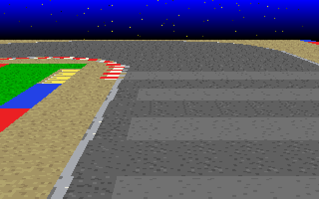

# Mode 7 course tour



This example loads the 128x128 course from `map.c` into BG0 and follows a closed lane automatically. Each map chip is 16x16 pixels, so the full course occupies the 2048x2048 BG. No player sprite is drawn.

The initial player top-left is chip **(114, 91)**, or world pixel (1824, 1456). The center of its future 16x16 sprite is (1832, 1464). The camera anchor is 80% down the visible ground, leaving more of the course ahead in view. With the default settings it is near logical screen pixel (160, 167). No sprite is drawn; a future unscaled 16px sprite would use the anchor minus (8, 8).

The player first joins the nearby lane smoothly, then travels counter-clockwise at **3.75 world pixels per frame** (225px/s at 60fps), keeping the inner course edge on its left. The generated lane allows approximately 16px between that edge and the assumed sprite, with a small allowance for source-grid rounding and corner smoothing. Camera heading follows a continuously interpolated point 64px ahead. It uses Q8.8 degrees, a non-overshooting smoothing response, and a maximum change of one degree per frame. Trigonometric interpolation preserves subdegree motion when calculating the Mode 7 matrix. `M7_FRAC0` carries the Q8.8 position fractions into the renderer so diagonal travel does not round each camera axis independently.

## Settings

Edit the definitions at the top of `program.c`, or pass compiler definitions through `CPPFLAGS`:

| Definition | Default | Meaning |
| --- | --- | --- |
| `PLAYER_INIT_X`, `PLAYER_INIT_Y` | `114`, `91` | Initial sprite top-left in 16px chips, each in 0..127 |
| `MAP_ANGLE` | `0` | Plane tilt in degrees, 0..75; 0 gives a flat overhead view |
| `MAP_ANGLE_DEPTH` | `66` | Perspective depth angle, 0..75; higher values make the top narrower than the bottom; 0 disables perspective |
| `MAP_VERTICAL_CHIP_NUM` | `128` | Vertical reference span in 16px chips, 1..128, before display scale and uniform tilt |
| `MAP_FOCAL_LENGTH` | `128` | Shorter focal lengths give stronger perspective; 100..4096 logical pixels |
| `CAMERA_GROUND_PERCENT` | `80` | Fixed camera anchor from the top (0) to bottom (100) of visible ground |
| `MAP_SCALE` | `400` | Display scale in percent, 4..3200; 100 means 1x |

`MAP_ANGLE` compresses the depth axis uniformly by `cos(MAP_ANGLE)`. `MAP_ANGLE_DEPTH` adds a perspective warp via BG0's `M7_DEPTH0` register. Higher depth angles make near objects larger relative to far objects, producing a trapezoid. `MAP_FOCAL_LENGTH` controls perspective strength independently: the default 128 creates a lower racing-camera view than the VDP default of 200. The near edge is fixed to the screen bottom; the margin above the plane stays transparent. The map continues across the full screen width, including outside the sloped sides of the reference trapezoid, as long as the source BG has pixels there. `MAP_SCALE` still controls the underlying map magnification. `MAP_VERTICAL_CHIP_NUM` changes only the vertical reference span: 25 chips represent 400px, twice the original 200px span. The visible depth is approximately `MAP_VERTICAL_CHIP_NUM * 100 / MAP_SCALE / cos(MAP_ANGLE)` chips from the far to the near edge; perspective redistributes these chips between screen rows. At the current 400% scale and zero uniform tilt, 128 gives 32 visible chips, with distant chips compressed into the upper part of the ground. The player remains at the configured camera anchor and the horizontal field of view is unchanged.

Very large vertical spans combined with small scales or steep uniform tilt can exceed the signed 8.8 matrix range. The example detects this at startup, prints a configuration error, and exits instead of wrapping the coefficients.

Set both angles to zero to disable tilt and perspective. The vertical chip count still adjusts the vertical field of view. Scrolling and rotation keep the future player at the configured point in the visible plane. The limits avoid overflowing affine coefficients or approaching the perspective singularity.

The defaults approximate `kart.png`: a sky band of about 20% at the top, ground filling the rest of the screen, large nearby features and a compressed distant course. The original map artwork and starting position remain in use. BG0 sets `M7_BACKDROP0` to `0x00A700`, filling samples beyond the full source map with green while preserving the upper sky margin.

Mode 7 settings are applied through the VGS Standard Library `vgs_mode7_*` APIs. Matrix coefficients remain signed 8.8 values; `vgs_mode7_frac(bg, x, y)` accepts two separate 1/256px fractions.

## Sky and stars

BG1 uses bitmap mode for a vertical sky gradient, blue (`0x0000FF`) at the top and black (`0x000000`) at the bottom. Its height follows the projected course top edge, so it fills only the upper margin. BG2 uses bitmap mode and `vgs_draw_pixel` for stars. Both layers stay transparent over the ground; without an upper margin they are hidden.

`STAR_COUNT` defaults to 1024 and accepts 0..1024. Stars start at random integer X coordinates in -320..639 and random Y coordinates within the sky. Their yellow brightness also determines their horizontal speed: brighter, nearer stars move faster (approximately 0.25..2 pixels per degree). Camera rotation moves them in the opposite direction, with fractional positions and wrapping over the 960px range. Only about one third of the stars are visible at once. Forward travel without rotation leaves the stars stationary.

## Build and run

```sh
make -C ../../lib
make -C ../../tools
make program.rom
make execute
```

For a flat 100% view, force recompilation when changing compiler flags:

```sh
make -B program.rom CPPFLAGS='-DMAP_ANGLE=0 -DMAP_ANGLE_DEPTH=0 -DMAP_SCALE=100'
```

`font.chr` occupies patterns 0..127. The build converts `mapchip.png` with `bmp2chr -s 1`, placing each chip's four 8x8 patterns consecutively from pattern 128. The course uses palette 0 extracted from `mapchip.png`.

## Course and lane data

`map.c` contains an 8-byte big-endian width/height header followed by 16,384 **zero-based** chip IDs. These differ from the one-based Tiled GIDs in `map.tmx`.

`generate-route.py` reads `map.c` and the 4x4 source-material patterns in `mapchip-patterns.json`. It finds the largest enclosed non-road region, offsets its boundary into the road, smooths the source-grid steps, and samples a closed lane at about 8px intervals. `route.h` stores these points and segment lengths in Q8.8 world pixels. The C program interpolates by distance, carrying unused movement across segment and lap boundaries.

The route is regenerated automatically when these inputs change, using Python 3's standard library. After editing the course, regenerate `map.c` from the TMX first. Update the material metadata too if chip identities change. This route generator assumes a single simple closed circuit; it rejects missing islands or ambiguous/disconnected boundaries. A changed initial position must be on the road near the lane, since the initial joining segment is not an obstacle-avoidance planner.

## Checks

```sh
make test
python3 ../../tools/bmp2pal/test.py
```

The example tests verify chip placement, initial coordinates, at least four laps, constant movement speed, continuous look-ahead across the lap seam, subdegree heading changes without waypoint oscillation, camera centering, and coefficient ranges for the default, flat, and steep/minimum-scale settings. Sky checks also cover gradient boundaries, star placement, distance-dependent movement, heading and screen wrapping, and overlapping pixels without trails. AddressSanitizer and UndefinedBehaviorSanitizer are enabled for these host tests.
